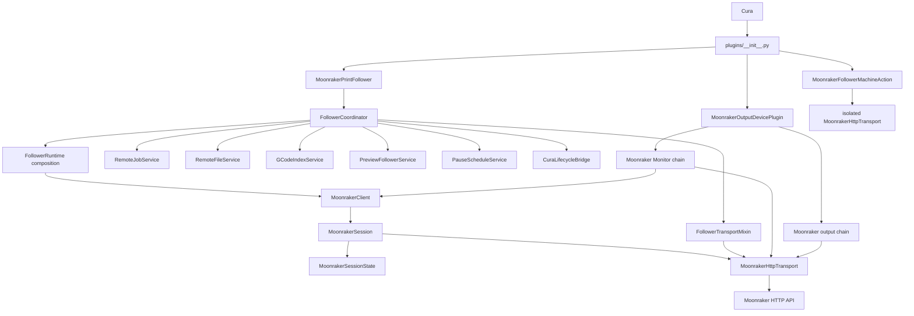

# Moonraker Print Follower architecture

This document is the architectural source of truth for Moonraker Print Follower. It describes the architecture that exists now, the boundaries that maintainers must preserve, and the decisions that explain why the system is shaped this way.

It is intentionally **not** a release-history document. Release numbers, migration narratives and implementation milestones belong in the changelog, Git history and release notes. Compatibility ranges and package metadata belong in the package metadata and CI configuration. This document should evolve whenever the architecture or an architectural decision changes.

If implementation and this document disagree, treat the disagreement as a defect: update the code or update this document in the same change.

---

## 1. How to use this document

Before changing the project, answer these questions:

1. **Who owns the state I need to change?**
2. **Which layer should perform the operation?**
3. **Which identity or generation makes an asynchronous result safe to apply?**
4. **Which existing request/data path should I extend instead of creating another one?**
5. **Does the change alter an architectural decision?** If so, update the decision register and the detailed decision entry.

Architectural rules in this document are stronger than naming conventions. A file name alone does not define ownership; follow the actual composition/inheritance chain and the ownership tables below.

---

## 2. Architecture at a glance

Moonraker Print Follower integrates three closely related capabilities into Cura:

- **Live Preview following** — Cura Preview follows the print currently running through Klipper/Moonraker.
- **Moonraker output** — Cura uploads generated G-code/UFP and can optionally start the print.
- **Live Monitor** — Cura exposes job state, temperatures, fans, sensors, macros, power, webcams and print controls.

They deliberately share one live active-printer session and transport rather than behaving like three independent plugins.

The main architectural commitments are:

- HTTP-only Moonraker integration;
- one live active-printer Moonraker session;
- one production core printer-status poller;
- one production active-printer HTTP connection pool;
- category-aware/adaptive polling;
- request coalescing and de-duplication;
- one authoritative owner per mutable domain;
- HTTP command acceptance separated from observed printer-state confirmation;
- stale asynchronous work rejected through identity/generation guards;
- large G-code streamed to disk rather than buffered wholly in memory;
- heavy indexing/hydration kept off Cura's UI thread;
- deterministic tests for state transitions, races and long-running prints;
- packaging and compatibility enforced by metadata and CI rather than duplicated in this document.

---

## 3. Top-level component model



The application is event-driven and runs inside Cura's Qt process. A small amount of background Python threading is used for G-code indexing, compact-index hydration and persistent-cache writes.

---

## 4. Architectural invariants

### 4.1 One authoritative owner per mutable domain

Do not create two classes that both remember the same concept.

| Domain | Authoritative owner |
| --- | --- |
| Moonraker endpoint/API-key identity, connection state, core status snapshot, poll policy, request coalescer, command acknowledgements | `MoonrakerSession` / `MoonrakerSessionState` |
| core status poll loop | `MoonrakerClient` |
| active-printer HTTP request construction, authentication, cancellation and metrics | `MoonrakerHttpTransport` |
| remote print-run identity and restart detection | `RemoteJobService` |
| remote file identity and local cached G-code identity | `RemoteFileService` |
| active G-code index/build/hydration state | `GCodeIndexService` |
| Preview attachment and expected follower-written Preview position | `PreviewFollowerService` |
| scheduled end-of-layer pause layers | `PauseScheduleService` |
| Cura scene/lifecycle generation token | `CuraLifecycleBridge` |
| follower-specific metadata/download/PAUSE request orchestration | `FollowerTransportMixin` |
| streaming G-code reply and temporary-file lifecycle | `RemoteFileTransferMixin` |

Coordinator compatibility properties redirect historical private attribute names into these owners. They are access shims, not duplicate state.

### 4.2 One live active-printer session

The plugin may store configuration for many Cura printers, but only Cura's currently active printer owns the live Moonraker binding.

Preview, Monitor and output all reach the same follower instance and therefore the same `MoonrakerClient`, `MoonrakerSession` and `MoonrakerHttpTransport`.

A Cura machine switch is an identity boundary. Old shared status, pending commands, file/index state, scheduled pauses and delayed callbacks must not become authoritative for the newly active printer.

### 4.3 One production core poller

`MoonrakerClient` is the only production poller for the core object query. The shared query contains the printer state needed by Preview and Monitor, including:

- `print_stats`;
- `gcode_move`;
- `virtual_sdcard`;
- `motion_report`.

Preview consumes this stream. Monitor consumes this stream. Output may use the resulting connected/status state as readiness evidence.

If another high-frequency field is required, extend the shared core query deliberately rather than adding another poller.

### 4.4 One production active-printer HTTP pool

Ordinary Moonraker traffic for the active printer uses `MoonrakerHttpTransport` and its `QNetworkAccessManager`.

Large downloads and multipart uploads may manage their own `QNetworkReply` lifecycle, but they still use the shared transport's request builder and network manager.

Isolated transports are allowed only when deliberately testing or probing credentials/identity that must not rebind the live session.

### 4.5 HTTP acceptance is not command completion

For commands with an observable printer-state result, the lifecycle is:

```text
issued -> HTTP accepted -> expected state observed
                    \-> failed / timed out
```

A successful HTTP response means Moonraker accepted the command. It does not prove that the printer reached the requested state.

### 4.6 Every asynchronous result needs a validity identity

An asynchronous result can become stale because:

- the active Cura printer changed;
- URL or API key changed;
- the same filename began a new print run;
- remote file identity changed;
- Cura replaced or rebuilt the scene;
- a newer request superseded an older request;
- G-code index work was cancelled or replaced.

Before applying an asynchronous result, validate every relevant identity/generation dimension described later in this document.

### 4.7 Never block Cura's UI thread

Do not add synchronous HTTP, `sleep()`, busy waits, or large synchronous file processing to Cura/Qt callbacks.

Use:

- Qt network replies for HTTP;
- `QTimer` for event-loop scheduling and retries;
- worker threads for heavy G-code indexing/hydration/cache writes;
- Qt signals or lifecycle-guarded callbacks when returning to UI state.

### 4.8 QML is presentation

QML may display Python model state and invoke exposed actions. It must not own Moonraker polling, protocol construction, hidden command state machines or durable business state.

### 4.9 Runtime mixins must not shadow one another

`FollowerRuntime.py` composes focused mixins. A method belongs to one runtime mixin. Do not implement the same method in multiple mixins and rely on MRO precedence.

Architecture contract tests enforce this rule.

---

## 5. Startup and dependency wiring

Cura enters through `plugins/__init__.py`.

`register(app)` creates one follower and injects it into the other feature areas:

```text
register(app)
 ├─ MoonrakerPrintFollower(app)
 │   └─ FollowerCoordinator
 │       ├─ domain services
 │       ├─ focused follower runtime
 │       └─ MoonrakerClient
 │           └─ MoonrakerSession
 │               └─ MoonrakerHttpTransport
 ├─ MoonrakerOutputDevicePlugin(app, follower)
 │   ├─ output device
 │   └─ Monitor model
 └─ MoonrakerFollowerMachineAction(app, follower, output_plugin)
```

The same follower instance is deliberately injected into output and Monitor. They must not rediscover or recreate an independent session from global state.

---

## 6. Configuration and multi-printer ownership

`PrinterConfig` is the typed persisted configuration for one Cura machine. `PrinterConfigStore` persists configuration keyed by Cura machine ID.

Configuration belongs to a Cura printer, not globally to the plugin.

The active Cura machine ID/name are maintained by the Cura-facing configuration/orchestration layer. The active Moonraker connection identity is `(base_url, api_key)` and belongs to the session/transport layer.

### Active machine switch

Conceptually:

1. detect a changed Cura machine ID;
2. stop the old `MoonrakerClient`;
3. stopping resets the shared session by default;
4. invalidate Cura lifecycle work;
5. change active Cura machine identity;
6. clear print/file/index/pause/Preview transient state;
7. load/migrate the new machine's configuration;
8. configure the shared client/session for the new Moonraker identity;
9. restart polling if the new endpoint is usable.

The reset occurs before the new binding is applied. This remains necessary even when two Cura machine definitions point to the same Moonraker endpoint because their Cura-side configuration can differ.

### Adding a persisted setting

1. add a typed/defaulted field to `PrinterConfig`;
2. update deserialisation/normalisation;
3. expose it through Machine Action/QML if user-configurable;
4. preserve old stored dictionaries through defaults;
5. migrate only when a semantically equivalent older setting exists;
6. add persistence/per-printer tests.

Do not create a parallel global preference for data that belongs to `PrinterConfig`.

---

## 7. Shared Moonraker session

### `MoonrakerSessionState`

Qt-independent state and policy:

- `PollPolicy`;
- `RequestCoalescer`;
- `SessionSnapshot`;
- `CommandTracker`;
- generation;
- base URL;
- connected state;
- scheduled-pause precision guard.

Keeping this state pure allows deterministic tests without a network or Qt event loop.

### `MoonrakerSession`

Binds session state to:

- base URL;
- API key;
- one `MoonrakerHttpTransport`.

Changing URL **or** API key is a rebind. Rebind cancels old transport work and resets shared status, command state, coalescing state, connection state and the pause guard so data obtained under the previous identity cannot remain authoritative.

### `MoonrakerClient`

Owns the Qt core poll loop and adapts the shared session to signals used elsewhere.

Responsibilities:

- configure/start/stop;
- issue the core status query;
- core request coalescing;
- retry/backoff;
- merge successful status into `SessionSnapshot`;
- derive capabilities;
- emit status/connection/capability/command changes;
- apply adaptive core polling intervals;
- force immediate refreshes when requested.

`MoonrakerClient` is not a second state owner. Its duplicated-looking connection/timer flags exist only to control the Qt poll lifecycle; shared connection/status/command policy belongs to the session.

---

## 8. Polling policy and request de-duplication

`RequestCategory` classifies requests as:

- `CORE`;
- `AUXILIARY`;
- `POWER`;
- `SYSTEM`;
- `DISCOVERY`;
- `COMMAND`;
- `STATIC`.

The policy intentionally varies freshness by printer state and request type:

- core status follows the configured cadence while actively printing;
- imminent scheduled pauses temporarily tighten core polling;
- paused/idle printers are polled less aggressively;
- Monitor peripheral, power, system and discovery data use slower category-specific cadences;
- commands and static lookups are event-driven.

Exact timing values are implementation policy in `PollPolicy`, not architectural constants. Change them there with tests rather than duplicating timing values in additional timers.

### Core coalescing

`RequestCoalescer` permits one core request in flight and at most one queued forced follow-up. Repeated refresh requests while one is in flight collapse into one additional poll.

### Non-core de-duplication

`MoonrakerHttpTransport` keys ordinary JSON requests by `(owner, channel)`. A running request on the same channel is rejected unless replacement is explicitly requested.

This prevents timer-driven Monitor calls and repeated UI actions from stacking duplicate requests.

---

## 9. Shared HTTP transport and observability

`MoonrakerHttpTransport` owns:

- the active-printer `QNetworkAccessManager` / HTTP connection pool;
- endpoint/API-key identity;
- standard request headers;
- transfer timeout where supported by the bundled Qt API;
- JSON encoding/decoding;
- Moonraker error conversion;
- request IDs;
- transport generation;
- owner/channel pending-request tracking;
- request/channel/owner cancellation;
- per-category request metrics.

### Owner/channel convention

Ordinary JSON traffic uses stable logical request identities such as:

```text
core::status
follower::metadata
follower::scheduled-pause
monitor::<channel>
output:<machine-id>::json
```

Choose a stable owner/channel pair for new JSON operations so replacement and cancellation semantics are explicit.

### Metrics

For JSON traffic sent through `send_json()`, the transport records:

- started count;
- completed count;
- failed count;
- average elapsed time.

Each completion is also debug-logged with request ID, category, channel, method, elapsed time and outcome. `MoonrakerClient.transport_metrics` exposes the aggregate metrics.

Streaming downloads and multipart uploads share the same request builder/network pool but manage their own reply lifecycle and are not counted through the JSON metrics path.

---

## 10. Command acknowledgement model

`CommandTracker` records:

- command name;
- expected printer states;
- issue timestamp and timeout;
- whether HTTP acceptance occurred;
- terminal state;
- outcome/detail.

Print controls such as Pause, Resume and Cancel define the printer states that confirm them. Scheduled PAUSE likewise expects an observed paused state.

The UI may show an accepted/waiting state after HTTP success. Only a later shared core-status update produces confirmation.

When adding a command whose result is visible in shared printer state, use `CommandTracker`; do not declare success inside the HTTP callback.

---

## 11. Public follower architecture

### `MoonrakerPrintFollower.py`

Tiny Cura-facing facade. It subclasses `FollowerCoordinator` and should remain intentionally small.

Do not place implementation logic here.

### `FollowerCoordinator.py`

Composition/orchestration layer. It creates the authoritative domain services before runtime initialisation and exposes compatibility properties that redirect historical private attributes into those services.

It coordinates cross-domain transitions such as:

- new print run -> clear old index/cache/pause state;
- active printer change -> reset job/file state;
- manual Preview movement -> detach following;
- scheduled-pause state -> tighten/relax the core poll guard;
- delayed Cura callbacks -> capture/check lifecycle token.

Do not turn the coordinator into a general implementation class. Policy that belongs to one domain should live in that domain's service.

### `FollowerRuntime.py`

Small concrete multiple-inheritance composition class. It declares follower signals/constants and combines focused runtime mixins.

It is a composition boundary, not a place for networking or unrelated feature logic.

---

## 12. Focused follower runtime mixins

| File | Primary responsibility |
| --- | --- |
| `FollowerBootstrap.py` | QObject/Extension setup, config/client construction, transient state, Cura signal wiring, timers, cache/temp roots |
| `FollowerConfiguration.py` | per-printer configuration, active-machine transfer, Preview attach/detach, URL/preference/status helpers |
| `CuraLifecycleRuntime.py` | scene/slicing lifecycle and lifecycle invalidation cleanup |
| `CuraViewBridge.py` | bind/rebind `SimulationView` and Preview layer/path signals |
| `CuraFileLifecycle.py` | Cura `fileCompleted`, shutdown/deinitialisation, worker/signal/temp cleanup |
| `PreviewFollowerRuntime.py` | Preview/toolhead behaviour and manual-view watch integration |
| `PreviewStatus.py` | Preview/QML status-property publication |
| `PreviewEta.py` | selected-layer/end-of-layer ETA calculation |
| `PreviewControls.py` | Preview QML control creation/visibility/reparenting |
| `PreviewLoad.py` | destructive current-print load confirmation and Cura load handoff |
| `PreviewFollowEngine.py` | shared Moonraker status -> layer-follow orchestration |
| `PathFollowEngine.py` | within-layer path progress and Z fallback |
| `GCodeIndexRuntime.py` | index/hydration worker mechanics around service-owned state |
| `RemoteFileTransfer.py` | streaming reply/temp-file lifecycle |

### Placement rule

When adding follower behaviour, choose the mixin whose responsibility matches the change. If none fits, decide whether the new responsibility deserves a new focused mixin or a domain service.

Do not place code in an arbitrary mixin simply because that mixin already has access to `self`.

### MRO rule

A runtime method belongs to one focused mixin. Cross-mixin shadow implementations are architecture violations.

### Import-closure rule

Every relative mixin import declared by `FollowerRuntime.py` must correspond to a real packaged source file. Architecture tests protect this because byte-compilation alone does not prove imports exist.

---

## 13. Domain services

### `RemoteJobService`

Owns remote print-run identity and restart detection.

A job key is:

```text
(filename, file_size, serial)
```

A new serial is produced when evidence indicates a new run, including transitions into active printing, filename/size changes, file-position rewind or significant print-duration rewind.

Never use filename alone as print identity.

### `RemoteFileService`

Owns:

- `RemoteFileIdentity`;
- which job metadata belongs to;
- cached local G-code filename/path/job key.

It does not perform HTTP.

### `GCodeIndexService`

Owns mutable index lifecycle state:

- generation;
- installed filename/job key;
- ranges;
- motion offsets;
- current-layer map;
- index data;
- active build filename/job key/cancel event/thread;
- hydrating-layer set/thread references.

`GCodeIndexRuntimeMixin` performs worker-thread mechanics, but lifecycle policy goes through `GCodeIndexService` methods.

`GCodeIndex.py` is separate: it contains index algorithms, data structures, timing/motion helpers and persistent-cache logic rather than live Cura state.

### `PreviewFollowerService`

Owns:

- whether Preview following is detached;
- expected current/minimum layer;
- expected current/minimum path;
- manual-override classification;
- the layer-decision write boundary into Cura.

Preview orchestration routes follower layer decisions through this service rather than bypassing it.

### `PauseScheduleService`

Owns the zero-based set of print-local end-of-layer pause targets and the add/remove/clear/due/imminent policy.

Pause targets are deliberately transient and are not part of persisted printer configuration.

### `CuraLifecycleBridge`

Owns the Cura lifecycle generation and last invalidation reason.

A delayed callback captures a token. If lifecycle invalidation occurs before execution, the token is stale and the callback is discarded.

---

## 14. Identity and stale-work model

There are several independent identity dimensions. Do not substitute one for another.

| Identity | Protects against | Owner |
| --- | --- | --- |
| Cura machine ID | applying one Cura machine's configuration/state to another | configuration/orchestration layer |
| `(base_url, api_key)` | stale authenticated state after endpoint/credential change | session/transport |
| client generation | late core HTTP callback after client stop/restart | `MoonrakerClient` |
| transport generation | late transport callback after reconfigure | `MoonrakerHttpTransport` |
| lifecycle generation | late work after Cura scene/slicing/load replacement | `CuraLifecycleBridge` |
| print job key `(filename, size, serial)` | same-filename reprints and old print callbacks | `RemoteJobService` |
| `RemoteFileIdentity` | persistent index/cache reuse for a changed remote file | `RemoteFileService` / index cache |
| index generation | cancelled/replaced build/hydration results | `GCodeIndexService` |
| specialised request generation | superseded status/pause/Monitor callbacks | relevant adapter |

Most concurrency bugs in this project are identity mismatches. Before mutating live state from an asynchronous result, explicitly identify which rows are relevant.

---

## 15. Follower-specific Moonraker transport

`FollowerTransportMixin` owns follower I/O that is not the generic core poll:

- explicit status load/test resolution;
- file metadata lookup;
- streaming G-code request startup;
- scheduled PAUSE request and acknowledgement bridge.

For the active connection it uses `self._client.transport`.

When an explicit probe targets a different unsaved identity, it uses an isolated transport so the live session is not reconfigured.

Specialised replies carry lifecycle/job/request identity guards before applying results.

---

## 16. Remote file download and cache flow

Large remote G-code must not be accumulated in Python memory.

`FollowerTransportMixin._begin_gcode_download()`:

1. creates a per-job temporary file target;
2. builds the request through shared `MoonrakerHttpTransport.request()`;
3. sends it through shared `transport.network`;
4. applies a bounded reply buffer;
5. connects `readyRead` for streaming writes;
6. captures Cura lifecycle generation and print job key.

`RemoteFileTransferMixin`:

- drains bytes incrementally;
- rejects stale lifecycle/job replies;
- verifies downloaded size when metadata provides one;
- adopts cached file identity through `RemoteFileService`;
- cleans or defers cleanup of per-job temp directories;
- hands the file to forced Cura load or index build.

---

## 17. G-code indexing and persistent cache

`GCodeIndex.py` provides parsing/index algorithms, layer timing information, motion offsets, compact indexes and persistent-cache serialization.

`GCodeIndexRuntimeMixin` runs heavy builds/hydration in worker threads while `GCodeIndexService` owns which generation/build/hydration is current.

### Index validity

An index is tied to the identities relevant to its creation and reuse, including:

- index generation;
- filename;
- print job key;
- remote file identity for persistent reuse;
- Cura lifecycle generation for worker completion.

### Compact indexes

Large persistent indexes may store compact layer ranges. The active layer is hydrated on demand and nearby work may be pre-hydrated.

While a compact layer is not hydrated, path progress is held at the layer start rather than using a coarse estimate that could later visibly rewind when exact offsets arrive.

### Persistent cache

Persistent reuse requires a sufficiently strong `RemoteFileIdentity`. Cache writes happen off the UI thread.

---

## 18. Preview following pipeline

High-level flow:

```text
shared core status
 -> update remote print-run identity
 -> resolve metadata/cache/index requirements
 -> resolve physical remote layer
 -> evaluate scheduled PAUSE state
 -> if detached: stop Preview movement but keep printer observation
 -> defer while Cura is slicing/rebuilding
 -> map remote layer to Cura layer
 -> FollowController decides visible layer window/mode
 -> PreviewFollowerService writes layer decision
 -> PathFollowEngine refines within-layer progress
 -> remember expected follower-written Preview position
 -> update ETA/toolhead/status
```

### Layer resolution priority

1. Moonraker explicit current-layer state;
2. G-code current-layer mapping if available;
3. configured layer-number conversion;
4. optional Z-height fallback when needed.

### Manual Preview override

Follower-written Preview positions are remembered. If Cura's actual layer/path later diverges outside the expected follower update, the user is considered to have manually changed Preview and following detaches.

Detaching does **not** stop Moonraker polling or physical layer observation. Scheduled PAUSE and remote timing state continue to operate.

### Within-layer path following

`PathFollowEngineMixin` combines:

- `virtual_sdcard.file_position`;
- indexed motion offsets;
- optional `motion_report.live_position` converted into G-code coordinate space;
- Cura path count.

Within one layer the displayed path fraction is monotonic. This prevents repeated or closed geometry from making Cura visibly rewind and retrace.

---

## 19. Scheduled end-of-layer PAUSE

Pause targets are zero-based internally and belong only to the current print.

A target becomes due only after Moonraker advances to a strictly later layer. Reaching the target layer itself must never pause at its beginning.

If polling skips across multiple scheduled targets, the crossed targets are consumed together and one PAUSE command is sufficient.

### Precision polling

When a target is imminent, `PauseScheduleService.is_imminent()` enables the shared session pause guard. `PollPolicy` temporarily tightens core polling without permanently increasing normal request load.

### Command path

The command is sent as normal Klipper G-code through the shared transport's command category.

Its HTTP completion callback validates:

- scheduled-pause request generation;
- Cura lifecycle generation;
- print job key.

HTTP success marks the command accepted. Shared status must subsequently observe the paused state before it is confirmed.

---

## 20. Force-load current print

Force-load is deliberately destructive and follows Cura's supported load lifecycle.

1. ensure/switch to Preview;
2. ask the user for confirmation through Cura/Qt UI;
3. defer destructive work to the event loop;
4. use shared active status when the requested credentials match the active session;
5. reuse cached or in-flight G-code when possible;
6. stream the file if needed;
7. suspend follower Preview writes while Cura parses;
8. call Cura's public local-file load path without adding the temporary file to recent files;
9. complete on Cura `fileCompleted`;
10. then rebuild/restore path-index work.

Do not manipulate Cura's scene directly to bypass its file-loading lifecycle.

---

## 21. Cura lifecycle and shutdown

`CuraLifecycleRuntimeMixin` reacts to structural lifecycle events such as:

- scene-root child changes;
- slicing start/cancel/finish;
- active view/main-window replacement;
- active-printer change through configuration orchestration.

`CuraLifecycleBridge.invalidate()` increments the lifecycle generation before stale delayed work can mutate the new scene.

`CuraFileLifecycleMixin` owns shutdown/deinitialisation. Core polling is stopped through `MoonrakerClient`.

Shutdown cleans or disconnects:

- manual Preview watch timer;
- lifecycle/network work;
- index/hydration/cache worker references;
- shared client;
- SimulationView signals;
- scene/backend/application signals;
- Preview controls;
- temporary files/directories.

Blocking thread joins are reserved for shutdown rather than ordinary interactive lifecycle changes.

---

## 22. Monitor architecture

The Monitor is layered:

```text
MoonrakerMonitorModel.py
  -> MoonrakerMonitorSession.py
    -> MoonrakerMonitorRuntime.py
      -> MoonrakerMonitorControls.py
        -> MoonrakerMonitorTypedControls.py
```

### Base model

The base model contains presentation/parsing and generic fallback HTTP helpers. It is not the production shared-session boundary by itself.

### `MoonrakerMonitorSession.py`

Production networking adapter. It:

- keeps the base core timer inactive;
- consumes the shared `MoonrakerClient.statusReceived` stream;
- routes peripheral JSON through `MoonrakerHttpTransport`;
- maps Monitor channels to `RequestCategory`;
- cancels requests by Monitor owner;
- adapts peripheral timer intervals through `PollPolicy`;
- uses shared `CommandTracker` for stateful print controls;
- binds the base network reference to the shared transport manager.

### Higher Monitor layers

- `MoonrakerMonitorRuntime.py`: follower-aware layer interpretation;
- `MoonrakerMonitorControls.py`: advanced live controls/runtime metadata;
- `MoonrakerMonitorTypedControls.py`: typed macro parameters, PWM, MCU, bed mesh and higher-level controls.

### Adding Monitor data

- core/high-frequency printer state -> extend the shared core query deliberately;
- Monitor-only peripheral/discovery data -> shared-transport Monitor channel with the correct category;
- presentation only -> appropriate higher Monitor layer/QML.

Do not activate an independent core poller.

---

## 23. Output/upload architecture

The output path is layered:

```text
MoonrakerOutputDevice.py
  -> MoonrakerOutputDeviceLifecycle.py
    -> MoonrakerOutputSession.py
```

`MoonrakerOutputDevicePlugin.py` instantiates the final session-aware output class and installs the final Monitor model.

### Base output device

Owns Cura writer/output mechanics, multipart upload, basic output operations and output presentation.

### Lifecycle layer

Adds re-entrancy-safe dialog/write completion and remote upload-directory discovery.

### `MoonrakerOutputSession.py`

Shared-session adapter. It:

- routes ordinary JSON through the shared transport;
- builds multipart requests using shared transport request construction;
- uses the shared network manager for multipart traffic;
- may treat existing shared connected/status state as readiness evidence;
- uses the established readiness flow through its shared `_json_request` override when additional checks are required;
- cancels its transport owner during cleanup;
- binds the base network reference to the shared transport manager.

New output functionality must use this shared path rather than creating another Moonraker client/session.

---

## 24. Connection testing and isolated probes

Testing unsaved endpoint/API-key values is intentionally isolated.

`MoonrakerFollowerMachineAction` uses a separate `MoonrakerHttpTransport` instance for candidate credentials. The live session is not rebound.

The follower may also use an isolated status probe when explicit requested credentials differ from the active transport identity.

The rule is:

> Reuse the transport implementation, not the live connection identity.

---

## 25. QML and Cura API boundaries

QML is a presentation/interaction adapter.

Important surfaces include:

- follower configuration;
- Preview action controls;
- empty-Preview controls;
- Monitor dashboard and bed-mesh views;
- upload dialog.

QML may bind Python properties and invoke exposed actions. It must not own polling, construct Moonraker request URLs, retain hidden command state or implement print-run identity.

Compatibility with the supported Cura/Qt/SDK range is defined by package/plugin metadata and guarded by source/CI compatibility tests. When compatibility policy changes, update those authoritative declarations and tests rather than duplicating numeric ranges here.

---

## 26. Error handling and graceful degradation

Moonraker/Klipper installations differ. Optional capabilities must fail soft.

Examples:

- metadata lookup failure -> weaker non-persistent file identity;
- missing motion-report data -> less precise path refinement, not broken layer following;
- missing explicit current-layer state -> optional Z fallback;
- missing heater/fan/sensor/macro/webcam objects -> omit those capabilities rather than failing Monitor;
- failed automatic Preview-stage switching -> connection/following state remains usable.

An optimisation failure must not destabilise Cura.

---

## 27. Threading model

### Qt/UI thread

Owns:

- QObject/QML manipulation;
- network reply callbacks;
- shared session orchestration;
- Preview writes;
- user-visible state.

### Worker threads

Used for:

- G-code index builds;
- compact layer hydration;
- persistent index-cache writes.

Workers must never mutate Cura/QML objects directly. Return through signals or lifecycle/identity-guarded callbacks.

### Cancellation

Ordinary lifecycle changes use cooperative cancellation plus generation invalidation. Shutdown may briefly join workers because the plugin object is being destroyed.

---

## 28. Extension guide

### Need another core printer field?

Extend the shared status endpoint/query and consume the new field from `MoonrakerClient`'s shared status stream.

### Need Monitor-only peripheral data?

Add a shared-transport Monitor channel and classify it with `RequestCategory`.

### Need a new printer command?

If completion is observable in shared status:

1. issue through shared transport;
2. register expected states in `CommandTracker`;
3. mark HTTP acceptance separately;
4. confirm from shared status;
5. expose accepted/confirmed/failed/timed-out UI states.

### Need new Preview-follow policy?

Pure layer/window decisions belong in `FollowController` or another pure helper. Live orchestration belongs in `PreviewFollowEngineMixin`. Attachment/expected-position state belongs in `PreviewFollowerService`.

### Need another path estimator?

Pure motion/index math belongs in `GCodeIndex.py`; live Cura path application belongs in `PathFollowEngineMixin`. Preserve monotonic within-layer progress.

### Need remote file behaviour?

- Moonraker request orchestration -> `FollowerTransportMixin`;
- file/cache identity -> `RemoteFileService`;
- streaming reply/temp-file lifecycle -> `RemoteFileTransferMixin`;
- index lifecycle -> `GCodeIndexService` + `GCodeIndexRuntimeMixin`.

### Need another background index operation?

Make `GCodeIndexService` own its active state/generation. Keep worker mechanics in `GCodeIndexRuntimeMixin` unless the work can be made fully pure.

### Need a Cura lifecycle hook?

Put structural lifecycle handling in `CuraLifecycleRuntimeMixin` and invalidate/guard with `CuraLifecycleBridge` whenever old callbacks could become unsafe.

### Need upload behaviour?

Use the output chain and shared transport. Do not create another Moonraker client.

### Need a new persisted option?

Use `PrinterConfig` / `PrinterConfigStore`.

---

## 29. Anti-patterns

Do not introduce any of the following without an explicit architecture decision:

- WebSockets beside the HTTP model;
- a second production core poller;
- a second active-printer HTTP manager for ordinary Moonraker traffic;
- direct Moonraker request construction inside focused follower runtime mixins;
- duplicate mutable domain state outside its authoritative owner;
- filename-only print identity;
- service wrappers that own the same state as another service;
- declaring stateful commands successful on HTTP acceptance alone;
- blocking waits or sleeps in Cura callbacks;
- worker threads mutating Cura/QML objects;
- async callbacks without relevant identity/generation checks;
- the same runtime method implemented by multiple follower mixins;
- implementation logic in the public facade;
- concentrating unrelated follower behaviour back into `FollowerRuntime.py`;
- persistent scheduled-pause layer numbers;
- whole-file remote G-code buffering;
- QML transport/protocol state machines.

---

## 30. Testing strategy

The test suite deliberately combines pure behavioural tests and source-architecture contracts.

### Deterministic Moonraker model

`tests/fake_moonraker.py` provides an in-process scripted Moonraker model with no sockets, threads or wall clock. It is used for state progression, command acknowledgement, scheduled PAUSE and long-running-print behaviour.

### Behavioural architecture coverage

Tests cover:

- category/state-aware polling;
- pause precision guard;
- core coalescing;
- endpoint/API-key rebind reset;
- command acceptance vs observed confirmation;
- deterministic command timeout;
- scheduled PAUSE progression;
- same-filename restart identity;
- long-print shared snapshot progression;
- stale lifecycle callback rejection;
- session generation/state invalidation;
- active Cura machine switch ordering;
- lifecycle/job/request guards on specialised follower replies.

### Source architecture contracts

Source-focused tests protect properties that are difficult to instantiate outside Cura, including:

- runtime import closure;
- no cross-mixin method shadowing;
- authoritative service use;
- absence of private Moonraker HTTP stacks in focused runtime code;
- shared Monitor/output transport use;
- shutdown ownership;
- QML/Cura API compatibility;
- package/Marketplace structure.

A source contract should supplement, not replace, a pure behavioural test when the relevant behaviour can be modelled cleanly.

---

## 31. CI and packaging definition of done

An architectural change is not complete merely because Python parses.

CI is expected to verify:

- QML structural sanity;
- the complete discovered test suite;
- Python source compilation across the supported CI runtimes;
- package/plugin metadata consistency;
- Cura package construction;
- exact source/package parity;
- Marketplace source archive construction and layout;
- CI artifact creation.

The source tree is the package source of truth. Generated package files, Python bytecode caches and other build artefacts do not belong in source control.

Package identity, release number and supported SDK declarations are authoritative in the package/plugin metadata and CI contracts. Do not duplicate their current numeric values in this architecture document.

---

## 32. Current compatibility seams

These are current implementation seams, not alternate architectural authorities.

### Coordinator property bridges

Some Cura-facing call sites still use historical private attribute names. `FollowerCoordinator` maps those names directly onto authoritative service state.

Future cleanup may reduce these bridges as call sites become service-native, but do not replace them with another state-bridge class or duplicate fields.

### Runtime multiple inheritance

Focused runtime mixins share the concrete follower object. This keeps Cura-facing responsibilities separated without introducing a large graph of proxy objects.

The cost is MRO discipline: each method must have one focused runtime owner, and shared mutable domain state must remain in services rather than mixins.

### Monitor/output base fallback helpers

Base Monitor/output classes contain generic fallback HTTP helpers for their standalone mechanics. Production session-aware subclasses route active-printer traffic through the shared session/transport and bind their network reference to the shared manager.

New features must target the session-aware production path rather than expanding a parallel fallback architecture.

---

## 33. Architectural decision register

This register records decisions that constrain future design. Detailed entries follow the table.

Status meanings:

- **Proposed** — under consideration; not yet an architectural rule.
- **Accepted** — current architectural rule.
- **Deprecated** — retained temporarily but should not receive new dependants.
- **Superseded** — replaced by another decision; retained for rationale/history.

| ID | Decision | Status | Primary consequence |
| --- | --- | --- | --- |
| ADR-001 | Moonraker integration is HTTP-only | Accepted | Improve polling/coalescing rather than adding a parallel WebSocket lifecycle |
| ADR-002 | Core printer state has one shared poller | Accepted | Preview and Monitor consume the same snapshot |
| ADR-003 | Session state is separated from Qt poll-loop orchestration | Accepted | Pure state remains deterministically testable |
| ADR-004 | Active-printer HTTP traffic shares one transport/pool | Accepted | Follower, Monitor and output reuse authentication, cancellation and connections |
| ADR-005 | Unsaved/alternate credential probes are isolated | Accepted | Probes must never rebind the live session |
| ADR-006 | Mutable domains have explicit authoritative services | Accepted | No overlapping state-wrapper classes |
| ADR-007 | Cura-facing follower behaviour is composed from focused runtime mixins | Accepted | `FollowerRuntime.py` stays a composition boundary |
| ADR-008 | Remote G-code is streamed to disk | Accepted | Large prints do not require whole-file memory buffering |
| ADR-009 | Stateful commands require observed-state confirmation | Accepted | HTTP success is an intermediate acknowledgement only |
| ADR-010 | Scheduled layer pauses are print-local transient state | Accepted | Pause layer numbers are never persisted as printer config |
| ADR-011 | Filename alone does not identify a print run | Accepted | Job-bound work validates `(filename, size, serial)` |
| ADR-012 | Cura machine identity and Moonraker connection identity are distinct | Accepted | Cura machine switches reset/rebind even when endpoints coincide |
| ADR-013 | Asynchronous work is guarded by explicit identities/generations | Accepted | Stale callbacks are discarded rather than trying to repair state afterward |
| ADR-014 | QML remains presentation-only | Accepted | Transport and domain state stay in Python owners |
| ADR-015 | Compatibility/support ranges live in metadata and CI, not architecture prose | Accepted | Architecture stays timeless as supported ranges evolve |

### Adding or changing a decision

When a change alters one of these constraints:

1. update the register;
2. add or amend the detailed ADR entry;
3. explain the context, decision, rationale, consequences and alternatives;
4. update implementation/tests in the same change;
5. mark the old ADR **Superseded** rather than silently rewriting history when the old rationale remains useful.

---

## 34. Detailed architectural decisions

### ADR-001 — HTTP-only Moonraker integration

**Status:** Accepted

**Context:** Cura needs current Moonraker state and commands, but multiple transport models would create separate connection, reconnection and consistency lifecycles.

**Decision:** Use HTTP for Moonraker state and commands. Do not introduce WebSockets as a parallel live-state path.

**Rationale:** Adaptive polling provides the required responsiveness while keeping transport, authentication, cancellation, observability and failure behaviour in one model.

**Consequences:** Optimise polling policy and request coalescing when responsiveness/load needs change. A future move to another transport model requires an explicit new ADR rather than an incremental side path.

### ADR-002 — One shared core status poller

**Status:** Accepted

**Context:** Preview and Monitor both need current print state. Independent polling produces duplicate traffic and potentially inconsistent snapshots of “now”.

**Decision:** `MoonrakerClient` owns the one core object poller. Consumers share its status snapshot.

**Consequences:** New core fields extend the shared query. Consumer-specific peripheral data uses slower separate categories rather than another core loop.

### ADR-003 — Separate pure session state from Qt poll orchestration

**Status:** Accepted

**Context:** Connection/status/command policy should be testable without requiring Cura or a Qt network event loop.

**Decision:** Keep policy/state in `MoonrakerSessionState`, bind it to transport through `MoonrakerSession`, and keep timer/signal orchestration in `MoonrakerClient`.

**Consequences:** Domain/session tests can be deterministic. `MoonrakerClient` must not become a shadow state owner.

### ADR-004 — One active-printer HTTP transport and connection pool

**Status:** Accepted

**Context:** Preview, Monitor and output all communicate with the same active printer.

**Decision:** Share `MoonrakerHttpTransport` and its network manager across active-printer traffic.

**Rationale:** This centralises authentication, request creation, connection reuse, cancellation and observability.

**Consequences:** Streaming/multipart operations may manage replies directly only if they still use the shared request builder and manager.

### ADR-005 — Isolated probes for unsaved or alternate credentials

**Status:** Accepted

**Context:** A user may test credentials that are not yet the active configuration.

**Decision:** Use a separate transport instance for candidate credentials rather than reconfiguring the live transport.

**Consequences:** Probe transports are allowed exceptions to the single live transport instance, but they are not production pollers and must not mutate live-session identity.

### ADR-006 — Explicit authoritative domain services

**Status:** Accepted

**Context:** Job identity, file identity, index lifecycle, Preview attachment, scheduled pauses and Cura lifecycle are independently mutable domains.

**Decision:** Each domain has one explicit state owner (`RemoteJobService`, `RemoteFileService`, `GCodeIndexService`, `PreviewFollowerService`, `PauseScheduleService`, `CuraLifecycleBridge`).

**Consequences:** Do not introduce wrapper classes that own the same state under different names. Coordinator property bridges may expose old access patterns but may not duplicate state.

### ADR-007 — Focused runtime composition

**Status:** Accepted

**Context:** Cura-facing behaviour spans scene lifecycle, Preview controls, file loading, ETA, path following, indexing and shutdown. Concentrating these responsibilities in one class makes ownership and testing difficult.

**Decision:** Compose the concrete follower from focused runtime mixins while keeping mutable domain state in services.

**Consequences:** `FollowerRuntime.py` remains small. Each runtime method belongs to one mixin. Cross-mixin shadow implementations are forbidden.

### ADR-008 — Stream remote G-code to disk

**Status:** Accepted

**Context:** Remote G-code can be large, and Cura must remain responsive while files are downloaded and indexed.

**Decision:** Stream network data incrementally into temporary files and build indexes asynchronously.

**Consequences:** Do not replace streaming with whole-response buffering. Temporary-file identity and cleanup are part of the download lifecycle.

### ADR-009 — Command completion is observed state, not HTTP success

**Status:** Accepted

**Context:** Moonraker can accept a command before the printer reaches the requested state.

**Decision:** Track HTTP acceptance separately from printer-state confirmation through `CommandTracker`.

**Consequences:** Stateful commands expose pending/accepted/confirmed/failed/timed-out states. New commands should define their expected state where observable.

### ADR-010 — Scheduled pauses are print-local

**Status:** Accepted

**Context:** A layer number has meaning only in the context of a particular print.

**Decision:** Scheduled end-of-layer pause targets are transient state tied to the current print run.

**Consequences:** They are cleared when print identity/lifecycle changes and are not persisted in `PrinterConfig`.

### ADR-011 — Print-run identity is stronger than filename

**Status:** Accepted

**Context:** The same G-code file can be printed repeatedly.

**Decision:** Use a job key containing filename, file size and a run serial. Restart evidence advances the serial.

**Consequences:** Job-bound cache/index/request work validates the full job key so a same-file reprint cannot inherit mutable state from an earlier run.

### ADR-012 — Cura machine identity is distinct from Moonraker connection identity

**Status:** Accepted

**Context:** Two Cura machine definitions may point to the same Moonraker endpoint yet have different follower/slicer configuration.

**Decision:** Cura machine ID selects persisted configuration; `(base_url, api_key)` identifies the live Moonraker connection.

**Consequences:** A Cura machine switch is a full ownership boundary and resets/rebinds the live session even if the network endpoint happens to be unchanged.

### ADR-013 — Explicit stale-work guards

**Status:** Accepted

**Context:** Network callbacks, delayed Qt callbacks and worker-thread results can complete after the state they were created for no longer exists.

**Decision:** Capture and validate the relevant lifecycle, client, transport, job, file, index and/or request identity before applying asynchronous results.

**Consequences:** Stale work is discarded. Do not attempt to “merge” late results into newer state unless the operation was explicitly designed to be identity-independent.

### ADR-014 — QML is presentation-only

**Status:** Accepted

**Context:** Transport/business state hidden in QML is difficult to test, reason about and share across Preview/Monitor/output.

**Decision:** Keep protocol, polling, domain state and command state machines in Python. QML binds to typed properties/actions.

**Consequences:** New UI features first expose Python state/actions, then bind presentation in QML.

### ADR-015 — Compatibility policy is declared outside architecture prose

**Status:** Accepted

**Context:** Supported runtime/SDK/package ranges evolve independently of the architecture.

**Decision:** Keep exact compatibility and release values in package/plugin metadata and CI tests. Architecture describes the responsibility and enforcement mechanism, not current numbers.

**Consequences:** Updating supported ranges does not require editing architecture unless the compatibility change alters an architectural decision or API boundary.

---

## 35. Maintainer checklist

Before implementation:

- identify the authoritative state owner;
- classify the data/request as core, peripheral, command, static, streaming file, upload or Cura-only;
- identify every lifecycle/identity that can invalidate the work;
- find the existing transport/session path to extend;
- check whether the change affects a registered architectural decision;
- check Cura/QML compatibility constraints through metadata and tests.

During implementation:

- keep state in one owner;
- use the shared transport;
- use `CommandTracker` where state confirmation exists;
- add generation/job/file/request guards before applying async results;
- keep heavy work off the UI thread;
- avoid cross-mixin method duplication;
- add behavioural tests when the state can be modelled without Cura;
- update source contracts when ownership legitimately moves.

Before considering the change complete:

- run the complete test and QML checks;
- compile all CI-supported Python runtimes;
- build and verify package outputs;
- re-read this document for architectural drift;
- update the decision register if the design changed.

---

## 36. Instructions for AI maintainers

1. Read this document before making architectural changes.
2. Inspect the actual inheritance/composition chain; do not infer responsibility from filenames alone.
3. Search for an existing state owner before creating a class or field.
4. Search for an existing transport owner/channel before adding a request.
5. Preserve the registered architectural decisions unless the task explicitly changes one.
6. Treat HTTP acceptance and observed printer-state completion separately.
7. Preserve active-machine, connection, Cura-lifecycle, job, file, index and request guards as applicable.
8. Do not recreate removed overlapping state wrappers under different names.
9. Do not put missing behaviour into `FollowerRuntime.py`; select the correct focused mixin/service.
10. When moving a method, update tests to follow the new owner and retain import-closure/ownership protection.
11. Do not weaken a failing architecture test merely to make CI green without first determining whether it exposed a real defect.
12. Update this document and the ADR register whenever an architectural responsibility or decision changes.

---

## 37. Glossary

**Active Cura printer** — the Cura machine currently owning the one live follower/session binding.

**Connection identity** — active Moonraker `(base_url, api_key)`.

**Core status** — the one shared fast Moonraker object query consumed by Preview and Monitor.

**Peripheral status** — slower Monitor-specific status/discovery outside the core query.

**Job key** — print-run identity `(filename, file_size, serial)`.

**File identity** — metadata-backed identity used for safe persistent cache/index reuse.

**Lifecycle generation** — token invalidated when Cura scene/slicing/load assumptions change.

**Index generation** — token invalidated when index build/hydration work is cancelled or replaced.

**Owner/channel** — shared transport key for one logical JSON request stream.

**Accepted command** — Moonraker accepted the HTTP request but expected printer state has not necessarily been observed.

**Confirmed command** — shared status observed an expected state for the command.

**Detached following** — Moonraker remains connected/polled, but follower does not move Cura Preview because the user detached or manually moved Preview.

**Compatibility seam** — current glue that redirects into the authoritative architecture and must not become a second state/transport owner.
