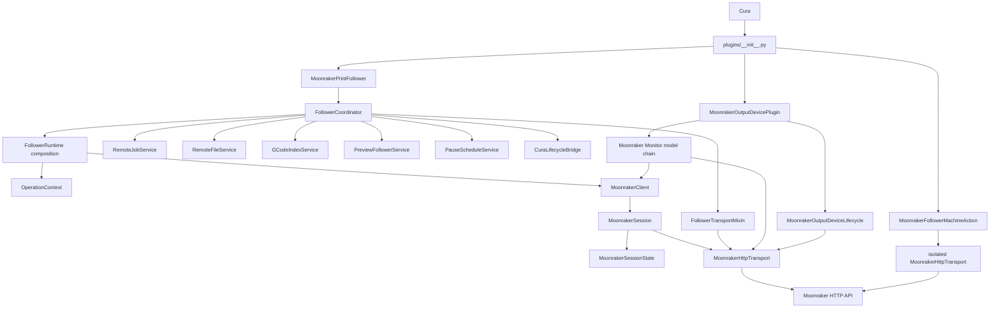
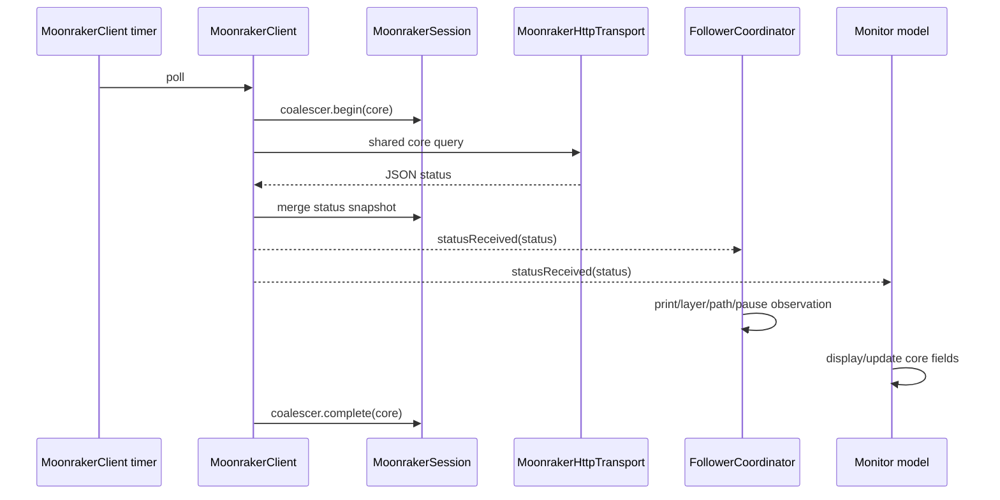

# Moonraker Print Follower architecture

This document is the architectural source of truth for Moonraker Print Follower. It is written for both human maintainers and AI agents: it explains what owns each piece of state, how the major flows work, which boundaries are intentional, and how to add functionality without recreating the coupling that the current architecture removed.

It is deliberately not a release-history document. Release numbers, migrations and implementation milestones belong in the changelog and Git history. Exact Cura/SDK compatibility ranges and package metadata belong in `package.json`, `plugin.json` and CI tests. Architecture should change only when responsibilities, data flow or architectural decisions change.

If the implementation and this document disagree, treat that as a defect. The correct change is to bring them back into agreement in the same branch, not to add a compatibility shim between the two models.

---

## 1. How to use this document

Before changing the project, answer these questions:

1. **Who owns the state I need?**
2. **Which existing layer performs this kind of operation?**
3. **Which identity or generation makes an asynchronous result safe to apply?**
4. **Which shared request/data path should be extended instead of duplicated?**
5. **Is the change pure policy, Cura orchestration, Moonraker I/O, or presentation?**
6. **Does the change alter an accepted architectural decision?**

Do not infer ownership from a filename alone. Follow the composition/inheritance chain and the ownership tables below.

When modifying code, prefer the shortest path from a consumer to the authoritative owner. Production code must not recreate removed private aliases merely to preserve an old internal access pattern.

---

## 2. System responsibilities

Moonraker Print Follower integrates three closely related Cura capabilities:

- **Live Preview following** — Cura Preview follows the physical print running through Klipper/Moonraker.
- **Moonraker output** — Cura can upload generated G-code/UFP and optionally start the print.
- **Live Monitor** — Cura displays job state, temperatures, fans, sensors, macros, power, webcams, bed mesh and print controls.

The three capabilities share one active-printer Moonraker session. They are not separate networking plugins.

The primary architectural commitments are:

- HTTP-only Moonraker integration;
- one live Moonraker binding for the active Cura printer;
- one production core status poller;
- one production active-printer HTTP connection pool;
- category-aware/adaptive polling;
- request coalescing/de-duplication;
- one authoritative owner for each mutable domain;
- direct service access rather than mirrored private aliases;
- HTTP acceptance separated from observed command completion;
- explicit identity/generation guards for asynchronous work;
- streamed remote G-code rather than whole-file buffering;
- asynchronous indexing/hydration for heavy work;
- presentation-only QML;
- deterministic behavioural tests plus source-level architectural contracts;
- package/source parity verified in CI.

---

## 3. Top-level component model



The plugin is event-driven inside Cura's Qt process. Background Python threads are used only for heavy G-code indexing, compact-index hydration and persistent-cache writes.

---

## 4. Architectural laws

These are invariants, not suggestions.

### 4.1 One authoritative owner per mutable domain

| Domain | Authoritative owner |
| --- | --- |
| active Moonraker endpoint/API-key identity | `MoonrakerSession` / `MoonrakerHttpTransport` |
| connection state, merged core status snapshot, poll policy, coalescer, command acknowledgements | `MoonrakerSessionState` |
| core status poll loop and retry/backoff | `MoonrakerClient` |
| active-printer request construction, authentication, cancellation and transport metrics | `MoonrakerHttpTransport` |
| remote print-run identity/restart detection | `RemoteJobService` |
| remote file identity and cached local G-code identity | `RemoteFileService` |
| G-code index/build/hydration lifecycle state | `GCodeIndexService` |
| Preview detached/attached state and expected follower-written Preview position | `PreviewFollowerService` |
| scheduled end-of-layer pause targets | `PauseScheduleService` |
| Cura lifecycle generation | `CuraLifecycleBridge` |
| current force-load/download/Cura-load/index operation phase | `OperationContext` |
| follower metadata/download/scheduled-PAUSE request orchestration | `FollowerTransportMixin` |
| streaming file reply/temp-file lifecycle | `RemoteFileTransferMixin` |

Consumers access these owners directly through the concrete follower. Production compatibility properties that mirror these values under historical private names are forbidden.

### 4.2 One live active-printer session

The project stores settings for multiple Cura machines, but only the currently active Cura machine owns the live Moonraker binding.

Preview, Monitor and output all receive the same follower instance and therefore share the same:

- `MoonrakerClient`;
- `MoonrakerSession`;
- `MoonrakerHttpTransport`.

A Cura-machine switch is an ownership boundary even when two Cura machine definitions point at the same network endpoint.

### 4.3 One production core poller

`MoonrakerClient` is the only production core printer-status poller.

The shared core snapshot contains high-frequency state required by Preview and Monitor, including the important objects around:

- `print_stats`;
- `virtual_sdcard`;
- `gcode_move`;
- `motion_report`.

Do not add a second core poller to Monitor, output or a new feature.

### 4.4 One production active-printer HTTP pool

Ordinary active-printer Moonraker traffic uses `MoonrakerHttpTransport` and its single `QNetworkAccessManager`.

Streaming downloads and multipart uploads may manage their own `QNetworkReply` lifecycle, but must use the shared transport's request builder and network manager.

An isolated transport is allowed only for candidate/unsaved credentials or another intentionally isolated identity that must not rebind the live session.

### 4.5 HTTP acceptance is not stateful command completion

For commands whose effect can be observed in printer state:

```text
issued -> HTTP accepted -> expected printer state observed -> confirmed
                    \-> HTTP/command failure
                    \-> timeout waiting for state
```

The HTTP callback is not the terminal success signal.

### 4.6 Every asynchronous result needs validity guards

An asynchronous result may be invalidated by:

- active Cura machine change;
- endpoint/API-key change;
- client stop/restart;
- transport reconfiguration;
- Cura scene/slicing/load lifecycle change;
- a new print run using the same filename;
- a changed remote file;
- a replacement index build;
- a superseding request.

Validate every identity relevant to the work before mutating current state.

### 4.7 Never block Cura's UI thread

Do not add:

- synchronous HTTP;
- `sleep()` in interactive callbacks;
- busy waits;
- large synchronous parsing/indexing operations.

Use Qt network replies, `QTimer`, worker threads and generation-guarded callbacks/signals.

### 4.8 QML is presentation

QML can bind properties and invoke actions. It must not own:

- polling;
- protocol URL construction;
- print-run identity;
- command state machines;
- hidden durable state.

### 4.9 Runtime mixins do not shadow each other

`FollowerRuntime.py` composes focused mixins. A runtime method has one implementation owner. Do not rely on MRO to choose between duplicate implementations.

### 4.10 Production modules are package modules

Production modules use normal package-relative imports. Do not add test-convenience fallbacks such as:

```python
try:
    from .Core import Thing
except ImportError:
    from Core import Thing
```

Tests must import production code through the package, not force production modules to support a second import topology.

---

## 5. Startup and dependency wiring

Cura enters through `plugins/__init__.py`.

Conceptually:

```text
register(app)
 ├─ MoonrakerPrintFollower(app)
 │   └─ FollowerCoordinator
 │       ├─ RemoteJobService
 │       ├─ RemoteFileService
 │       ├─ GCodeIndexService
 │       ├─ PreviewFollowerService
 │       ├─ PauseScheduleService
 │       ├─ CuraLifecycleBridge
 │       ├─ focused follower runtime
 │       │   └─ OperationContext
 │       └─ MoonrakerClient
 │           └─ MoonrakerSession
 │               └─ MoonrakerHttpTransport
 ├─ MoonrakerOutputDevicePlugin(app, follower)
 │   ├─ Moonraker output device
 │   └─ Monitor model
 └─ MoonrakerFollowerMachineAction(app, follower, output_plugin)
```

The coordinator creates authoritative domain services before the runtime bootstrap runs. That ordering allows runtime mixins to use services from their first initialisation callback without creating temporary shadow fields.

`FollowerTransportMixin` participates cooperatively in construction. It initializes its plain transient request/download state before calling `super().__init__(application)`, then creates its QObject-dependent isolated probe transport after the runtime/bootstrap has initialized QObject. Do not move transport-owned reply/request fields back into `FollowerBootstrap.py` or restore a post-construction `_init_follower_transport()` phase.

The same follower is injected into Monitor and output. They must not rediscover the active connection from preferences and create independent clients.

---

## 6. Configuration and active-printer ownership

### `PrinterConfig`

Typed persisted configuration for one Cura machine. It contains follower, upload, Monitor/webcam and related options.

### `PrinterConfigStore`

Persists per-machine configuration keyed by Cura machine ID and normalises/deserialises older stored dictionaries through typed defaults.

Configuration belongs to a Cura machine, not globally to the plugin.

### Two distinct identities

Do not conflate:

- **Cura machine identity** — selects persisted Cura/follower configuration;
- **Moonraker connection identity** — `(base_url, api_key)` for the live transport/session.

Two Cura machines can point at the same Moonraker endpoint and still require a full active-machine ownership transition.

### Active-machine switch ordering

The safe conceptual order is:

1. detect changed Cura machine ID;
2. stop the old `MoonrakerClient`;
3. reset old session state;
4. invalidate Cura lifecycle generation;
5. update active Cura machine identity;
6. clear print/file/index/pause/Preview transient state;
7. load the new machine configuration;
8. configure the shared client/session for the new Moonraker identity;
9. restart polling if the endpoint is usable.

Old callbacks must become harmless before the new binding becomes authoritative.

### Adding a persisted option

1. add the typed/defaulted field to `PrinterConfig`;
2. normalise it in deserialisation;
3. expose it via Machine Action/QML if user-facing;
4. preserve absent old values through defaults;
5. migrate only when an older semantically equivalent setting exists;
6. test per-printer persistence and switching.

Do not create a parallel global preference for per-printer data.

---

## 7. Shared Moonraker session

### `MoonrakerSessionState`

Qt-independent state/policy owner containing:

- `PollPolicy`;
- `RequestCoalescer`;
- `SessionSnapshot`;
- `CommandTracker`;
- session generation;
- base URL;
- connected state;
- scheduled-pause precision guard.

Keeping this layer pure enables deterministic tests without Cura or a Qt event loop.

### `MoonrakerSession`

Binds `MoonrakerSessionState` to one `MoonrakerHttpTransport` and API key.

Changing endpoint or credentials is a rebind. Rebind must invalidate/cancel work from the previous authenticated identity and reset:

- shared status;
- connection state;
- coalescer state;
- command tracker;
- pause precision guard.

### `MoonrakerClient`

Qt core-poll adapter around the session.

Responsibilities:

- configure/start/stop;
- issue the shared core object query;
- coalesce overlapping core refreshes;
- retry/back off after failures;
- merge successful status into the session snapshot;
- derive capabilities;
- emit status/connection/capability/command signals;
- adjust core cadence using `PollPolicy`;
- force immediate refresh on demand.

`MoonrakerClient` is not a duplicate state owner. Its timer/request flags control the poll lifecycle only.

---

## 8. Polling model

`RequestCategory` separates traffic by freshness requirement:

- `CORE`;
- `AUXILIARY`;
- `POWER`;
- `SYSTEM`;
- `DISCOVERY`;
- `COMMAND`;
- `STATIC`.

The policy is adaptive:

- active print core state follows the configured cadence;
- imminent scheduled pauses may temporarily tighten the core cadence;
- paused/idle core state can be slower;
- auxiliary Monitor data uses its own cadence;
- power/system/discovery data are intentionally slower;
- commands/static lookups are event-driven.

Exact milliseconds are implementation policy in `PollPolicy`, not architecture prose.

### Core coalescing

`RequestCoalescer` permits one in-flight core request and at most one pending forced follow-up. Multiple refresh requests collapse rather than queueing unbounded network traffic.

### Non-core request lanes

`MoonrakerHttpTransport.send_json()` identifies ordinary JSON traffic by `(owner, channel)`.

A lane can have one running request. A caller must explicitly choose replacement if newer data supersedes the old request.

---

## 9. Shared HTTP transport

`MoonrakerHttpTransport` owns:

- one active-printer `QNetworkAccessManager`;
- base URL and API key;
- standard headers;
- request construction;
- supported transfer timeout handling;
- JSON encoding/decoding;
- Moonraker error conversion;
- owner/channel request tracking;
- cancellation by lane/owner/all;
- transport generation;
- request IDs;
- per-category metrics.

Example logical lanes:

```text
core::status
follower::metadata
follower::scheduled-pause
monitor::aux
monitor::power-list
output:<machine-id>::json
```

Choose stable owner/channel names for new operations so cancellation/replacement semantics remain obvious.

### Streaming and multipart exception

`send_json()` is for ordinary JSON calls. Two operations legitimately manage reply objects directly:

- streamed G-code downloads;
- multipart uploads.

They still build requests through `transport.request()` and send through `transport.network`. They do not create another manager.

---

## 10. Transport observability

For JSON traffic, `MoonrakerHttpTransport` records per-category:

- started count;
- completed count;
- failed count;
- average elapsed time.

Debug logging includes request ID, category, logical lane, HTTP method, elapsed time and outcome.

When diagnosing network load:

1. identify which category is producing requests;
2. identify owner/channel;
3. check whether replacement/coalescing is expected;
4. check whether printer state changed the cadence;
5. confirm there is still only one core poll path.

Do not add a second instrumentation layer that independently tracks connection state.

---

## 11. Command acknowledgement

`CommandTracker` owns the lifecycle of commands whose completion is visible in shared printer state.

A tracked command includes:

- logical name;
- expected printer states;
- issue time;
- timeout;
- accepted state;
- terminal outcome/detail.

Typical flow:

```mermaid
sequenceDiagram
    participant UI
    participant Adapter
    participant HTTP as Shared transport
    participant Tracker as CommandTracker
    participant Core as MoonrakerClient core poll

    UI->>Adapter: request Pause/Resume/Cancel/etc.
    Adapter->>Tracker: issue(expected states)
    Adapter->>HTTP: POST
    HTTP-->>Adapter: accepted
    Adapter->>Tracker: accepted
    Note over UI,Tracker: UI may show "accepted; waiting..."
    Core->>Tracker: observe printer state
    Tracker-->>UI: confirmed / timed out / failed
```

If a new command has an observable state transition, use this model rather than inventing a local busy flag that calls HTTP success “done”.

---

## 12. `OperationContext`

`OperationContext` is the authoritative lifecycle state for a current follower operation that spans remote resolution/download and Cura loading/indexing.

Its phases are:

- `IDLE`;
- `RESOLVING`;
- `DOWNLOADING`;
- `CURA_LOADING`;
- `INDEXING`;
- `READY`;
- `ERROR`.

It also carries the relevant filename/job/local-path/start-time/message context.

Use it for questions such as:

- is a forced current-print load in progress?;
- which file is being loaded into Cura?;
- may a temporary cache directory be deleted now?;
- did a download failure terminate the forced-load operation?;
- which phase should Preview status expose?

Do not recreate old boolean fields for force-load or Cura-load state alongside `OperationContext`.

---

## 13. Public follower and composition

### `MoonrakerPrintFollower.py`

Tiny public Cura-facing facade over `FollowerCoordinator`.

Keep it tiny. Do not put feature implementation here.

### `FollowerCoordinator.py`

Cross-domain composition/orchestration layer.

It creates the authoritative services and coordinates transitions that genuinely span domains, such as:

- new print run -> invalidate old index/cache/pause state;
- cache adoption/discard -> filesystem cleanup;
- manual Preview movement -> detach following;
- scheduled-pause proximity -> toggle shared core precision guard;
- delayed Cura callback -> capture/check lifecycle token;
- active session status -> route into follower observation when enabled.

The coordinator does **not** expose historical service-state aliases. Runtime and transport code access the authoritative services directly.

Do not turn the coordinator into a replacement monolith. Domain policy belongs in the relevant service or pure helper.

### `FollowerRuntime.py`

Small multiple-inheritance composition class. It declares the concrete follower's signals/constants and combines focused Cura-facing mixins.

It is a composition boundary, not an implementation dumping ground.

---

## 14. Focused follower runtime mixins

| File | Primary responsibility |
| --- | --- |
| `FollowerBootstrap.py` | QObject/Extension setup, config/client creation, transient UI state, signals/timers/cache/temp roots |
| `FollowerConfiguration.py` | per-printer configuration, active-machine switching, attach/detach, URL/preference/status helpers |
| `CuraLifecycleRuntime.py` | scene/slicing lifecycle invalidation and cleanup |
| `CuraViewBridge.py` | SimulationView binding/rebinding and layer/path signals |
| `CuraFileLifecycle.py` | Cura `fileCompleted`, shutdown/deinitialisation, worker/signal/temp cleanup |
| `PreviewFollowerRuntime.py` | Preview/toolhead behaviour and manual-view watch integration |
| `PreviewStatus.py` | Preview/QML status property publication |
| `PreviewEta.py` | selected-layer/end-of-layer ETA |
| `PreviewControls.py` | Preview QML control creation/visibility/reparenting |
| `PreviewLoad.py` | destructive current-print load confirmation and Cura handoff |
| `PreviewFollowEngine.py` | shared status -> remote-layer -> Preview orchestration |
| `PathFollowEngine.py` | within-layer path application and Z fallback |
| `GCodeIndexRuntime.py` | index/hydration worker mechanics around service-owned state |
| `RemoteFileTransfer.py` | streamed reply and temporary-file lifecycle |

### Placement rule

Put new behaviour in the mixin matching its responsibility. If no current responsibility fits, decide whether the change deserves:

- a new focused mixin for Cura-facing orchestration; or
- a new/purer domain service/helper.

Do not put a method somewhere merely because that class has `self` access to everything.

### MRO rule

A method has one runtime-mixin implementation owner. Source tests enforce this.

---

## 15. Domain services

### `RemoteJobService`

Owns remote print-run identity and same-file restart detection.

A job key is:

```text
(filename, file_size, serial)
```

The serial advances when evidence indicates a new run, including transitions into active printing, filename/size change, significant file-position rewind or print-duration rewind.

Never use filename alone as print identity.

### `RemoteFileService`

Owns:

- `RemoteFileIdentity`;
- which job the metadata identity belongs to;
- cached local G-code filename;
- cached local G-code path;
- cached job key.

It does not perform HTTP or filesystem deletion.

### `GCodeIndexService`

Owns live mutable index lifecycle state:

- generation;
- installed filename/job key;
- layer ranges;
- motion offsets;
- current-layer map;
- `LayerMotionIndex` data;
- current build filename/job/cancel event/thread;
- active hydration layers/threads.

`GCodeIndexRuntimeMixin` performs worker mechanics but goes through service state/methods.

### `PreviewFollowerService`

Owns:

- attached/detached following state;
- expected current/minimum layer;
- expected current/minimum path;
- classification of manual Preview override;
- the layer-decision write boundary into Cura.

### `PauseScheduleService`

Owns zero-based print-local pause targets and schedule/remove/clear/due/imminent policy.

Targets are transient. They are not persisted in `PrinterConfig`.

### `CuraLifecycleBridge`

Owns Cura lifecycle generation and last invalidation reason.

Delayed work captures a token; invalidation makes old tokens stale.

---

## 16. Identity and race-safety model

Different identities solve different races.

| Identity/generation | Protects against | Owner |
| --- | --- | --- |
| Cura machine ID | old machine config/state applied to newly selected machine | configuration/orchestration |
| `(base_url, api_key)` | results obtained under old endpoint/credentials | session/transport |
| client generation | late core HTTP result after client restart | `MoonrakerClient` |
| transport generation | late request after transport reconfigure | `MoonrakerHttpTransport` |
| Cura lifecycle generation | late scene/slicing/load callback | `CuraLifecycleBridge` |
| print job key | same-file reprint / old print work | `RemoteJobService` |
| remote file identity | persistent cache/index reuse for changed file | `RemoteFileService` + cache |
| index generation | cancelled/replaced index work | `GCodeIndexService` |
| specialised request generation | superseded pause/probe/Monitor request | relevant adapter |

A callback often needs more than one guard. For example, scheduled PAUSE completion validates request generation, Cura lifecycle generation and print job key.

Never replace a strong identity with a weaker one for convenience.

---

## 17. Follower-specific Moonraker I/O

`FollowerTransportMixin` owns follower I/O that is not the generic core poll:

- explicit status test/force-load resolution;
- metadata lookup and its in-flight filename identity;
- streamed G-code request startup plus its transient reply/download handles;
- scheduled PAUSE HTTP/acknowledgement bridge.

It initializes those transient request/download fields itself through cooperative MRO construction. `FollowerBootstrapMixin` must not become a shadow owner for them. `RemoteFileTransferMixin` owns the streamed reply processing/cleanup behaviour while operating on the transfer state initialized by `FollowerTransportMixin`.

For the active identity it always uses `self._client.transport`.

For candidate/alternate credentials it may use a dedicated isolated `MoonrakerHttpTransport` so the live session is not rebound.

The mixin reads authoritative state directly from:

- `RemoteJobService`;
- `RemoteFileService`;
- `GCodeIndexService`;
- `PreviewFollowerService`;
- `CuraLifecycleBridge`;
- `OperationContext`.

Do not reintroduce `_remote_job_key`, `_remote_file_identity`, `_following_paused`, `_lifecycle_generation` or equivalent mirrored aliases.

---

## 18. Remote metadata and file identity

Metadata is used to strengthen `RemoteFileIdentity` for safe cache/index reuse.

Flow:

1. observe current filename/size from shared status;
2. check whether `RemoteFileService` already has suitable identity for the current job;
3. request metadata through shared transport if needed;
4. validate lifecycle generation and job key on completion;
5. parse/set strong identity on success;
6. on metadata failure, fall back to weaker non-persistable identity where safe;
7. continue live following rather than making metadata an availability dependency.

The shared transport owns the real JSON request/reply lane. Follower metadata keeps only the logical pending filename needed for de-duplication; it does not fabricate a second reply object or mirror transport request state.

Metadata is an optimisation and identity-strengthening mechanism, not a prerequisite for basic printing/monitoring.

---

## 19. Remote G-code streaming

Large G-code must never be buffered as one Python response body.

### Request startup (`FollowerTransportMixin`)

1. create a per-job temporary target;
2. build the download request with shared `transport.request()`;
3. send with shared `transport.network`;
4. set a bounded network read buffer where supported;
5. capture lifecycle generation and job key locally for the completion callback;
6. connect `readyRead` and `finished`.

### Reply lifecycle (`RemoteFileTransferMixin`)

- drain chunks incrementally to disk;
- reject stale lifecycle/job results;
- close/flush the target;
- verify byte size when metadata supplies one;
- adopt the cache through `RemoteFileService`;
- hand off to forced Cura load or index build;
- clean the job temp directory when safe;
- defer deletion while Cura is still parsing that path.

`RemoteFileTransferMixin` uses `OperationContext` to determine whether a file is part of an active force-load/Cura-load operation.

---

## 20. G-code indexing architecture

### `GCodeIndex.py`

Pure/data-heavy indexing layer containing:

- `LayerMotionIndex`;
- slicer layer-marker parsing;
- current-layer mapping;
- motion offsets/coordinates;
- file-position fraction;
- live-position refinement;
- monotonic progress floor support;
- compact large-file indexes;
- layer hydration;
- persistent cache serialization/pruning.

It is a normal package module and uses package-relative imports. Tests import it as `plugins.GCodeIndex`.

### `GCodeIndexService.py`

Live authoritative index lifecycle state.

### `GCodeIndexRuntime.py`

Worker/thread orchestration:

- start/cancel index builds;
- emit/consume completion signals;
- hydrate compact layers;
- persist cache asynchronously;
- guard completion with lifecycle/job/index identities.

### Compact large-file behaviour

For large files, boundary/index data can be kept compact and exact motion data hydrated only for active/nearby layers.

While a compact layer is awaiting hydration, visible path progress is held at a safe position rather than using a coarse estimate that could later rewind when exact offsets arrive.

### Persistent cache

Persistent reuse requires a sufficiently strong `RemoteFileIdentity`. Cache writes are off the UI thread and atomic replacement is used where applicable.

---

## 21. Shared core-status data flow



Preview/Monitor see the same logical core observation. They do not independently ask “what is the printer doing now?”

---

## 22. Preview following pipeline

High-level flow:

```text
shared core status
 -> identify print run
 -> establish metadata/file/index needs
 -> resolve physical remote layer
 -> observe scheduled-pause crossing
 -> if detached, stop Preview writes but continue observation
 -> defer while Cura is rebuilding/slicing
 -> FollowController decides visible layer range/mode
 -> PreviewFollowerService writes the layer decision
 -> PathFollowEngine applies within-layer progress
 -> remember follower-written expected Preview position
 -> update ETA/toolhead/status
```

### Layer resolution priority

1. explicit Moonraker layer information;
2. G-code current-layer map when available;
3. configured one-based/zero-based conversion;
4. optional Z-height fallback.

### `FollowController`

Pure follower intent state machine. It decides whether following may write Preview and how layer visibility behaves for exact/completed/lookahead/window modes.

Do not bury these pure policy decisions in QML or transport callbacks.

---

## 23. Within-layer path following

`PathFollowEngineMixin` uses service-owned state directly.

Inputs can include:

- `virtual_sdcard.file_position`;
- indexed motion offsets;
- live physical tool position from `motion_report` converted into G-code space;
- Cura's number of visible paths.

The visible fraction is monotonic within a layer. This matters because closed/repeated geometry can make the physical XYZ position match an earlier segment; without a monotonic floor, Preview can visibly jump backwards and retrace.

If exact compact-layer motion data is not hydrated yet, path application waits/holds rather than guessing ahead and later rewinding.

---

## 24. Preview attachment and manual override

`PreviewFollowerService` remembers the Preview layer/path values written by the follower.

A manual override is detected when Cura's observed Preview values diverge from the expected follower-written state outside a follower update.

On manual change:

1. mark following detached;
2. invalidate toolhead path display as appropriate;
3. update `FollowController` to user-override state;
4. remember the user's current Preview state;
5. update Preview controls/status.

Detaching Preview does **not** stop shared polling, print-run observation, ETA state or scheduled-PAUSE evaluation.

This separation is important: “do not move Cura Preview” is not the same as “stop observing the printer.”

---

## 25. Scheduled end-of-layer PAUSE

Targets are zero-based internally and scoped to the current print run.

A pause becomes due only when Moonraker has advanced to a layer strictly greater than the target. Reaching the target layer itself must never pause at its beginning.

If polling jumps across more than one scheduled target, crossed targets can be consumed together; one PAUSE is sufficient because the printer will already stop.

### Precision guard

When a target is imminent, `PauseScheduleService.is_imminent()` enables the shared session pause guard. `PollPolicy` temporarily tightens the **existing core poller**.

It does not create a dedicated pause poll loop.

### Command path

The adapter sends normal Klipper `PAUSE` through the shared command transport.

The HTTP completion validates:

- scheduled request generation;
- current Cura lifecycle generation;
- current print job key.

HTTP success marks acceptance. Only shared status observing `paused` confirms the command.

---

## 26. Force-load current print

Force-loading the running G-code into Cura is intentionally treated as a destructive Cura file-load operation.

Conceptual flow:

1. ensure/switch to Preview where appropriate;
2. ask user confirmation;
3. defer destructive work to the Qt event loop;
4. resolve active print from shared status (or isolated probe for a different candidate identity);
5. use compatible cached/in-flight G-code when available;
6. stream the file if required;
7. update `OperationContext` to Cura-loading state;
8. suspend follower Preview writes while Cura parses;
9. call Cura's supported local-file load API with `add_to_recent_files=False`;
10. complete from Cura's `fileCompleted` lifecycle;
11. restore/rebuild index/follow state as appropriate.

Do not mutate Cura's scene manually to bypass its supported file lifecycle.

---

## 27. Cura lifecycle and stale callback protection

`CuraLifecycleRuntimeMixin` handles structural events such as:

- scene structure replacement;
- slicing start/cancel/finish;
- load-related transitions;
- other Cura events that invalidate assumptions held by delayed work.

`CuraLifecycleBridge.invalidate(reason)` increments the generation first. Work captured under the old token becomes stale.

`FollowerCoordinator._queue_lifecycle_callback()` captures the bridge token and discards the callback if lifecycle changed before execution.

### Shutdown

`CuraFileLifecycleMixin` owns deinitialisation and cleans/disconnects:

- manual Preview watch timer;
- shared client;
- network/request work;
- SimulationView signals;
- scene/backend/application signals;
- worker references;
- Preview controls;
- temp files/directories.

Blocking thread joins are acceptable during final shutdown, not normal interactive state transitions.

---

## 28. Monitor architecture

The production Monitor inheritance chain is:

```text
MoonrakerMonitorModel.py
  -> MoonrakerMonitorRuntime.py
    -> MoonrakerMonitorControls.py
      -> MoonrakerMonitorTypedControls.py
```

There is no separate Monitor session-wrapper layer.

### `MoonrakerMonitorModel.py`

The base Monitor model is itself shared-session-native. It owns:

- generic Monitor presentation/parsing;
- consumption of `follower.client.statusReceived` for core printer state;
- Monitor request-generation invalidation;
- shared-transport JSON helper for peripheral channels;
- mapping channels to `RequestCategory`;
- adaptive auxiliary/power/system/discovery timers using shared `PollPolicy`;
- metadata-based Monitor ETA fallback;
- webcams/power/system/peripheral parsing;
- shared command acknowledgement for Pause/Resume/Cancel.

It has no private `QNetworkAccessManager` and no independent core status endpoint poller.

### `MoonrakerMonitorRuntime.py`

Adds follower-aware physical/current-layer interpretation. It reads the public `follower.gcode_index` service boundary instead of follower-private index aliases.

### `MoonrakerMonitorControls.py`

Adds richer live controls, runtime state and control behaviour.

### `MoonrakerMonitorTypedControls.py`

Adds typed macros, PWM, MCU statistics, remembered webcams, bed mesh and higher-level typed controls.

### Adding Monitor data

- high-frequency/core printer state -> extend shared core query deliberately;
- Monitor-only peripheral/discovery -> add a Monitor shared-transport channel with correct category;
- derived display state -> appropriate Monitor model layer;
- presentation -> QML.

Never create another core timer/network manager.

---

## 29. Output/upload architecture

The production output inheritance chain is:

```text
MoonrakerOutputDevice.py
  -> MoonrakerOutputDeviceLifecycle.py
```

`MoonrakerOutputDevicePlugin.py` instantiates the lifecycle-enhanced class directly. There is no output session-wrapper layer.

### `MoonrakerOutputDevice.py`

Owns:

- Cura output-device integration;
- G-code/UFP writer selection;
- upload naming/path options;
- power-on/readiness orchestration;
- ordinary output JSON requests through `follower.transport.send_json()`;
- request construction through shared transport;
- multipart upload through `transport.network.post()`;
- upload progress/result UI;
- reuse of shared client status as readiness evidence;
- output transport-owner cancellation during cleanup.

It does not create its own `QNetworkAccessManager`.

### `MoonrakerOutputDeviceLifecycle.py`

Adds:

- re-entrancy-safe Cura write completion;
- deferred upload-dialog teardown;
- exactly-once terminal write signalling;
- remote writable upload-directory discovery;
- folder option publication.

### Output rule

New output functionality extends this chain and shared transport. It does not create another Moonraker session, client or compatibility subclass.

---

## 30. Connection tests and isolated probes

Candidate credentials cannot safely reuse the **identity** of the live transport because testing them would rebind/cancel the current printer.

`MoonrakerFollowerMachineAction` therefore uses an isolated `MoonrakerHttpTransport` for candidate endpoint/API-key tests.

Follower explicit probing can use the same pattern when requested credentials differ from the active transport identity.

The rule is:

> Reuse the transport implementation; isolate the candidate identity.

An isolated probe is not a second production poller and must not become a source of live session state.

---

## 31. QML and Cura API boundary

QML surfaces include:

- follower configuration;
- Preview action controls;
- empty-Preview controls;
- Monitor views/dashboard/bed mesh;
- upload dialog.

QML may:

- bind Python properties;
- render models;
- invoke exposed slots/actions;
- manage presentation-local temporary values.

QML must not:

- poll Moonraker;
- own command acknowledgement;
- construct transport URLs for business logic;
- identify print runs;
- maintain domain state independently from Python.

Cura/Qt compatibility constraints are enforced by metadata and tests. Optional newer APIs must remain capability-guarded where required by supported SDK versions.

---

## 32. Threading model

### Qt/UI thread

Owns:

- QObject/QML manipulation;
- normal network callbacks;
- session/client orchestration;
- Preview writes;
- user-visible state.

### Worker threads

Used for:

- G-code index building;
- compact layer hydration;
- persistent index-cache writes.

Workers must not mutate Cura/QML objects directly.

### Worker return path

A worker result must be applied only after validating relevant:

- lifecycle generation;
- job/file identity;
- index generation/build identity.

Generation invalidation is preferred to blocking cancellation during normal interaction.

---

## 33. Graceful degradation

Moonraker/Klipper installations differ. Optional features must fail soft.

Examples:

- metadata failure -> weaker non-persistent file identity;
- missing `motion_report` -> less precise path refinement;
- missing explicit layer -> configured conversion/Z fallback where possible;
- absent optional heaters/fans/sensors/macros/webcams -> omit those capabilities;
- failed automatic Preview switching -> keep core connection usable;
- unavailable persistent index -> build from streamed file;
- unavailable exact compact-layer motions -> hold safe path position while hydrating.

An optimisation failure must not destabilise Cura or stop unrelated monitoring.

---

## 34. Module ownership map

### Core/session/protocol

| File | Role |
| --- | --- |
| `Core.py` | small pure shared primitives including `OperationContext`, `RemoteFileIdentity`, pause/Preview helpers |
| `MoonrakerProtocol.py` | Moonraker endpoint/payload/coordinate helpers |
| `MoonrakerSession.py` | pure session state/policy plus transport binding |
| `MoonrakerTransport.py` | shared Qt HTTP transport/pool |
| `MoonrakerClient.py` | shared core poll loop and signals |
| `FollowController.py` | pure follower intent state machine |

### Follower composition and services

| File | Role |
| --- | --- |
| `MoonrakerPrintFollower.py` | tiny public facade |
| `FollowerCoordinator.py` | service composition/cross-domain orchestration |
| `FollowerRuntime.py` | focused runtime-mixin composition |
| `FollowerTransport.py` | follower-specific Moonraker I/O adapter and transient request/download state initialization |
| `RemoteJobService.py` | print-run identity |
| `RemoteFileService.py` | file/cache identity |
| `GCodeIndexService.py` | live index lifecycle state |
| `PreviewFollowerService.py` | Preview attachment/expected writes |
| `PauseScheduleService.py` | print-local pause schedule |
| `CuraLifecycleBridge.py` | lifecycle generation |

### Follower runtime

Use the responsibility table in section 14. Runtime mixins orchestrate Cura-facing work but must not become alternate owners of the service state above.

### G-code/index/data

| File | Role |
| --- | --- |
| `GCodeIndex.py` | parsing/index algorithms and persistent index cache |
| `GCodeIndexRuntime.py` | worker mechanics |
| `DownloadStream.py` | incremental download target abstraction |
| `RemoteFileTransfer.py` | streamed reply/temp lifecycle |
| `PathFollowEngine.py` | live within-layer mapping |

### Monitor

| File | Role |
| --- | --- |
| `MoonrakerMonitorModel.py` | shared-session-native base Monitor model + peripheral transport |
| `MoonrakerMonitorRuntime.py` | follower-aware layer mapping |
| `MoonrakerMonitorControls.py` | live control layer |
| `MoonrakerMonitorTypedControls.py` | typed/advanced control layer |
| Monitor QML files | presentation |

### Output

| File | Role |
| --- | --- |
| `MoonrakerOutputDevice.py` | shared-transport-native Cura output/upload implementation |
| `MoonrakerOutputDeviceLifecycle.py` | safe write/dialog/folder lifecycle extension |
| `MoonrakerOutputDevicePlugin.py` | active-machine output/Monitor installation |
| `MoonrakerUploadDialog.qml` | presentation |

### Configuration/UI

| File | Role |
| --- | --- |
| `PrinterConfig.py` | typed per-printer persisted configuration |
| `MoonrakerFollowerMachineAction.py` | settings backend + isolated connection test |
| `MoonrakerFollowerConfiguration.qml` | settings presentation |
| Preview QML files | Preview controls presentation |

---

## 35. Adding functionality: decision guide

### Need another high-frequency printer field?

Extend the shared core query and consume it from the shared status snapshot. Do not create a new poller.

### Need Monitor-only data?

Use `MoonrakerMonitorModel._json_request()`/shared transport with an appropriate `RequestCategory` and cadence.

### Need a new stateful printer command?

1. issue via shared transport;
2. register expected state(s) in `CommandTracker`;
3. mark HTTP acceptance separately;
4. confirm from shared core status;
5. surface pending/confirmed/failure states.

### Need a stateless command?

Use the shared transport command category. If there is no observable completion state, HTTP result may be the terminal protocol result, but do not invent a fake confirmation.

### Need new print-run state?

First ask whether it belongs inside `RemoteJobService`. Do not store another filename/serial tuple in a runtime mixin.

### Need new remote file/cache state?

Use/extend `RemoteFileService`. Network work remains in `FollowerTransportMixin`; filesystem/reply mechanics remain in `RemoteFileTransferMixin`.

### Need new indexing policy/math?

- pure parsing/math -> `GCodeIndex.py`;
- live index state -> `GCodeIndexService`;
- thread orchestration -> `GCodeIndexRuntimeMixin`.

### Need new Preview follow policy?

- pure layer/mode decision -> `FollowController` or another pure helper;
- attachment/expected-position state -> `PreviewFollowerService`;
- live status orchestration -> `PreviewFollowEngineMixin`;
- within-layer path application -> `PathFollowEngineMixin`.

### Need a new long-running follower operation?

Consider whether it should be represented as an `OperationContext` phase/field instead of adding boolean flags.

### Need a Cura lifecycle hook?

Use the appropriate Cura runtime mixin and invalidate/capture `CuraLifecycleBridge` whenever old callbacks could become unsafe.

### Need output/upload behaviour?

Extend the output chain and shared transport.

### Need a new persisted setting?

Use `PrinterConfig`/`PrinterConfigStore`.

### Need to test unsaved credentials?

Use an isolated instance of `MoonrakerHttpTransport`; do not rebind the live session.

---

## 36. Anti-patterns rejected by architecture

Do not introduce:

- WebSockets alongside the HTTP live-state model;
- a second production core poller;
- another active-printer `QNetworkAccessManager` for ordinary Moonraker traffic;
- Monitor/output session-wrapper subclasses whose only purpose is to redirect to the shared transport;
- duplicated service state under private compatibility properties;
- top-level/relative dual-import fallback shims in production modules;
- follower transport request/reply fields initialized in `FollowerBootstrap.py` or a second post-construction transport initializer;
- filename-only print identity;
- service wrappers that own the same state as another service;
- direct success for stateful commands on HTTP acceptance;
- blocking waits/sleeps in Cura callbacks;
- worker-thread Cura/QML mutation;
- asynchronous mutation without relevant identity checks;
- duplicate runtime-mixin method implementations;
- domain/business logic in the public facade;
- unrelated behaviour accumulated in `FollowerRuntime.py` or the coordinator;
- persisted scheduled-pause layer numbers;
- whole-file remote G-code buffering;
- QML-owned transport/business state machines.

When a source architecture test fails on one of these, assume it found a real problem until proven otherwise.

---

## 37. Testing architecture

The suite combines behavioural tests and source contracts because Cura/Qt integration boundaries are not all practical to instantiate in a headless unit test.

### Pure behavioural tests

Prefer pure tests for:

- polling policy;
- request coalescing;
- command tracker;
- remote job identity/restart detection;
- pause scheduling/due semantics;
- `OperationContext` transitions;
- G-code parsing/indexing;
- path-refinement math;
- persistent index cache.

### Deterministic fake Moonraker

`tests/fake_moonraker.py` models scripted status progression without sockets, threads or wall clock.

It is used for:

- shared snapshot progression;
- command acceptance/confirmation;
- scheduled PAUSE behaviour;
- long-running print simulations.

### Race/lifecycle tests

Tests should cover:

- endpoint/API-key rebind invalidation;
- active Cura machine switch ordering;
- stale lifecycle callback rejection;
- same-filename print restart;
- stale metadata/download/pause callback rejection;
- index generation replacement;
- Monitor request-generation invalidation.

### Source architecture contracts

Source contracts enforce properties that are architectural even when full Cura instantiation is impractical:

- thin facade;
- expected runtime composition;
- no cross-mixin shadowing;
- required authoritative services;
- absence of removed duplicate wrappers;
- no private active-printer HTTP stack in focused runtime/Monitor/output;
- direct service access rather than historical aliases;
- follower transport ownership of transient request/download state;
- no production dual-import fallbacks;
- shared Monitor/output transport;
- QML/Cura API compatibility patterns;
- package/Marketplace invariants.

Do not weaken a source contract solely because a refactor made it fail. First determine whether the failure identified architecture drift.

---

## 38. CI and packaging definition of done

An architectural change is not complete because Python parses locally.

CI is expected to verify:

- QML structural sanity;
- all discovered tests;
- Python source compilation across supported CI runtimes;
- package/plugin metadata consistency;
- Cura package construction;
- exact source/package projection;
- Marketplace source ZIP construction/layout;
- CI artifacts.

The source tree is the package source of truth.

Do not track:

- generated `.curapackage` files;
- `__pycache__`;
- `.pyc`/`.pyo` files;
- other generated release artefacts.

Package ID/version/support declarations are authoritative in package/plugin metadata and CI tests rather than duplicated here.

---

## 39. Debugging by subsystem

### Printer appears disconnected

Check:

1. active Cura machine configuration;
2. session/transport identity;
3. shared client running state;
4. core request outcome/backoff;
5. transport generation/rebind logs.

### Monitor data stale

Check whether the field is:

- core shared status; or
- Monitor auxiliary/power/system/discovery data.

Then check the corresponding category cadence and Monitor request lane. Do not add a faster duplicate poller as a diagnostic workaround.

### Preview follows wrong layer

Inspect:

1. remote job identity;
2. explicit Moonraker current layer;
3. `GCodeIndexService.current_layer_map`;
4. one-based conversion setting;
5. optional Z fallback;
6. detached state;
7. Cura lifecycle/slicing suppression.

### Preview jumps backwards within a layer

Inspect:

- file-position vs live-position refinement;
- hydrated motion data;
- monotonic path floor;
- whether a new layer/job legitimately reset progress.

Do not remove monotonic protection to make one trace look closer to parser position.

### Scheduled PAUSE misses target

Inspect:

- zero-based target;
- observed physical layer progression;
- pause precision guard;
- core poll cadence;
- job identity;
- scheduled-pause request generation;
- command acceptance vs observed paused confirmation.

### Wrong/stale G-code used

Inspect:

- current `RemoteJobService.key`;
- `RemoteFileService.identity`;
- cached job key/path;
- lifecycle generation;
- download size validation;
- index filename/job key/generation.

---

## 40. Architectural decision register

Status meanings:

- **Proposed** — under consideration;
- **Accepted** — current rule;
- **Deprecated** — temporarily retained, no new dependants;
- **Superseded** — replaced by a later decision.

| ID | Decision | Status | Primary consequence |
| --- | --- | --- | --- |
| ADR-001 | Moonraker live integration is HTTP-only | Accepted | Improve polling/coalescing rather than adding WebSocket lifecycle |
| ADR-002 | Core printer state has one shared poller | Accepted | Preview and Monitor consume one logical snapshot |
| ADR-003 | Session policy/state is separated from Qt poll orchestration | Accepted | Deterministic session tests |
| ADR-004 | Active-printer traffic shares one HTTP transport/pool | Accepted | Follower, Monitor and output reuse connections/auth/cancellation |
| ADR-005 | Candidate/alternate credential probes are isolated | Accepted | Probe identity never rebinds live session |
| ADR-006 | Mutable domains have explicit authoritative owners | Accepted | No overlapping state-wrapper classes |
| ADR-007 | Cura-facing follower behaviour uses focused runtime composition | Accepted | `FollowerRuntime.py` remains a composition boundary |
| ADR-008 | Remote G-code is streamed to disk | Accepted | Large prints do not require whole-file memory |
| ADR-009 | Stateful commands require observed-state confirmation | Accepted | HTTP success is intermediate |
| ADR-010 | Scheduled layer pauses are print-local transient state | Accepted | No persisted layer targets |
| ADR-011 | Filename alone does not identify a print run | Accepted | Job-bound work validates `(filename,size,serial)` |
| ADR-012 | Cura machine identity and Moonraker connection identity are distinct | Accepted | Machine switch resets ownership even for same endpoint |
| ADR-013 | Async work uses explicit identities/generations | Accepted | Stale results are discarded |
| ADR-014 | QML is presentation-only | Accepted | Protocol/domain state stays in Python |
| ADR-015 | Exact compatibility ranges live in metadata/CI | Accepted | Architecture prose remains range-independent |
| ADR-016 | Production code accesses authoritative services directly | Accepted | No service-state compatibility aliases/wrapper layers |
| ADR-017 | Production modules have one package import topology | Accepted | Tests import `plugins.*`; no dual-import fallbacks |

---

## 41. Detailed architectural decisions

### ADR-001 — HTTP-only Moonraker integration

**Decision:** Moonraker live state and commands use HTTP. Do not add WebSockets as a parallel state path.

**Rationale:** One transport model keeps authentication, cancellation, retry, observability and consistency understandable. Responsiveness is achieved through adaptive polling and coalescing.

### ADR-002 — One shared core status poller

**Decision:** `MoonrakerClient` owns the core object poller; Preview and Monitor consume its status.

**Consequence:** New high-frequency core fields extend the shared query rather than creating consumer poll loops.

### ADR-003 — Pure session state separated from Qt polling

**Decision:** policy/state lives in `MoonrakerSessionState`, transport binding in `MoonrakerSession`, timers/signals in `MoonrakerClient`.

**Consequence:** connection/poll/command policy remains deterministic and testable without Qt networking.

### ADR-004 — One active-printer HTTP transport/pool

**Decision:** active-printer Follower, Monitor and output share `MoonrakerHttpTransport`.

**Consequence:** direct streaming/multipart replies are permitted only through the shared request builder/network manager.

### ADR-005 — Isolated candidate credential probes

**Decision:** candidate credentials use a separate transport instance.

**Consequence:** connection testing cannot cancel/reconfigure the live printer session.

### ADR-006 — Explicit domain ownership

**Decision:** print identity, file identity, index state, Preview attachment, pause schedule and Cura lifecycle each have one service owner; `OperationContext` owns long-running operation phase.

**Consequence:** a new class may orchestrate these owners but may not mirror their mutable state.

### ADR-007 — Focused follower runtime composition

**Decision:** Cura-facing responsibilities are split into focused mixins composed by `FollowerRuntime.py`.

**Consequence:** each runtime method has one mixin owner; stateful domains remain services rather than mixin fields.

### ADR-008 — Stream remote G-code

**Decision:** download incrementally to temporary files and index asynchronously.

**Consequence:** do not replace streaming with whole-response buffering.

### ADR-009 — Observed command completion

**Decision:** a stateful command is confirmed only after shared status observes an expected state.

**Consequence:** UI distinguishes requested/accepted/confirmed/failure/timeout.

### ADR-010 — Print-local scheduled pauses

**Decision:** pause targets are transient current-print state.

**Consequence:** clear on print identity changes; never persist target layers as printer settings.

### ADR-011 — Strong print-run identity

**Decision:** use `(filename, file_size, serial)` rather than filename alone.

**Consequence:** same-file reprints cannot inherit mutable job-bound state.

### ADR-012 — Cura identity differs from Moonraker identity

**Decision:** Cura machine ID selects configuration; `(base_url,api_key)` identifies live network binding.

**Consequence:** switching Cura machine is a full ownership transition even if endpoints match.

### ADR-013 — Explicit stale-work guards

**Decision:** async work captures and validates relevant lifecycle/client/transport/job/file/index/request identity.

**Consequence:** stale work is discarded rather than merged into newer state.

### ADR-014 — QML presentation-only

**Decision:** polling/protocol/business state stays in Python owners.

**Consequence:** expose Python properties/actions first, then bind QML.

### ADR-015 — Compatibility policy outside architecture prose

**Decision:** exact package/SDK/runtime support values live in metadata and tests.

**Consequence:** routine compatibility-range updates do not make architecture prose stale.

### ADR-016 — Direct authoritative-service access

**Context:** Transitional refactors can leave old private names mapped onto new services, making the system look cleaner while preserving two mental models and encouraging new code to use obsolete names.

**Decision:** production code accesses `RemoteJobService`, `RemoteFileService`, `GCodeIndexService`, `PreviewFollowerService`, `PauseScheduleService`, `CuraLifecycleBridge` and `OperationContext` directly. Dedicated Monitor/output compatibility session wrappers are not part of the production architecture.

**Consequences:** source contracts reject the historical aliases and removed wrapper modules. When a call site moves to a service, tests move with it rather than adding an access shim.

### ADR-017 — One production package import topology

**Context:** Test-convenience `except ImportError` fallbacks made production modules support both package-relative and top-level import modes.

**Decision:** production modules use normal package-relative imports. Tests import production code through `plugins.*`.

**Consequences:** source contracts reject dual-import fallbacks. Test harnesses adapt to production packaging, not vice versa.

---

## 42. Maintainer checklist

### Before implementation

- identify the authoritative state owner;
- classify the operation as core state, peripheral data, command, static lookup, stream, upload, Cura lifecycle, pure policy or presentation;
- list every identity/generation that can invalidate asynchronous work;
- find the existing shared transport owner/channel;
- inspect the concrete inheritance/composition path;
- decide whether an architectural ADR changes.

### During implementation

- keep mutable state in one owner;
- access services directly;
- use shared transport/session;
- use `CommandTracker` for observable stateful commands;
- use `OperationContext` instead of parallel operation booleans;
- apply lifecycle/job/file/index/request guards before async mutation;
- keep heavy work off the UI thread;
- avoid runtime-mixin shadowing;
- import production modules through the package;
- add behavioural tests where practical;
- strengthen source contracts when an architectural invariant matters.

### Before completion

- run all discovered tests;
- run QML structural checks;
- compile all CI-supported Python runtimes;
- build/verify Cura package;
- verify Marketplace archive/source parity;
- inspect transport/state ownership for duplication;
- re-read this document for drift;
- update ADRs if the decision changed.

---

## 43. Instructions for AI maintainers

1. Read this document before architectural work.
2. Inspect actual code and inheritance; do not infer ownership from names alone.
3. Search for an existing state owner before adding a field/class.
4. Search for an existing owner/channel before adding a Moonraker request.
5. Never create a second core poller to make a feature easier.
6. Never recreate historical private service aliases to avoid editing call sites.
7. Never add a compatibility wrapper merely to preserve a removed internal inheritance layer.
8. Tests must import production modules through the package; do not modify production import topology for test convenience.
9. Distinguish HTTP acceptance from state confirmation.
10. Preserve all relevant machine/connection/lifecycle/job/file/index/request guards.
11. Keep `MoonrakerPrintFollower.py` and `FollowerRuntime.py` small.
12. Put new domain state in the appropriate service; put pure policy in pure helpers.
13. Keep follower transport request/download state with `FollowerTransportMixin`; do not move it into bootstrap or restore a second transport initializer.
14. Treat an architecture-test failure as a potential production defect first.
15. When moving ownership, update code, tests and this document in the same architectural change.
16. Do not silently weaken an ADR. If a decision needs changing, document the new decision and consequences explicitly.

---

## 44. Glossary

**Active Cura printer** — Cura machine currently owning the one live session binding.

**Connection identity** — `(base_url, api_key)` used by the active Moonraker session/transport.

**Core status** — the shared high-frequency Moonraker object snapshot emitted by `MoonrakerClient`.

**Peripheral status** — slower Monitor-only status/discovery outside the core query.

**Job key** — `(filename, file_size, serial)` identifying one print run.

**Remote file identity** — metadata-backed identity used to decide whether persistent cache/index data is reusable.

**Lifecycle generation** — `CuraLifecycleBridge` token invalidated when old Cura scene/slicing/load assumptions are no longer safe.

**Index generation** — token invalidated when index build/hydration work is replaced/cancelled.

**Request generation** — adapter-local serial used when a newer request supersedes an older one.

**Owner/channel** — logical lane used by `MoonrakerHttpTransport` for de-duplication/cancellation.

**Accepted command** — Moonraker accepted the HTTP request; target state has not necessarily been observed.

**Confirmed command** — shared status observed an expected state for a tracked command.

**Detached following** — printer observation continues but the follower stops changing Cura Preview because the user detached/manually moved it.

**Compact index** — layer-boundary index that hydrates exact motion data on demand for large files.

**Operation context** — authoritative state describing a current resolving/downloading/Cura-loading/indexing workflow.

---

## 45. Architectural summary

The architecture can be reduced to a few rules:

- **One active printer, one shared session, one core poller, one active HTTP pool.**
- **One mutable owner for each domain.**
- **Consumers talk directly to those owners; internal compatibility aliases are not architecture.**
- **HTTP acceptance and physical printer-state completion are different events.**
- **Asynchronous work is valid only for the identities/generations it was created for.**
- **Cura stays responsive: stream files, use worker threads for heavy indexing, never block UI callbacks.**
- **Monitor and output are natively shared-session-aware; there are no session-wrapper compatibility layers.**
- **Production code has one package import topology; tests adapt to it.**
- **QML presents state rather than owning it.**
- **Architecture tests exist to prevent the system from drifting back toward duplicate state, duplicate networking and shadow abstractions.**

When adding functionality, preserve those rules first. The rest of the design becomes substantially easier to reason about.