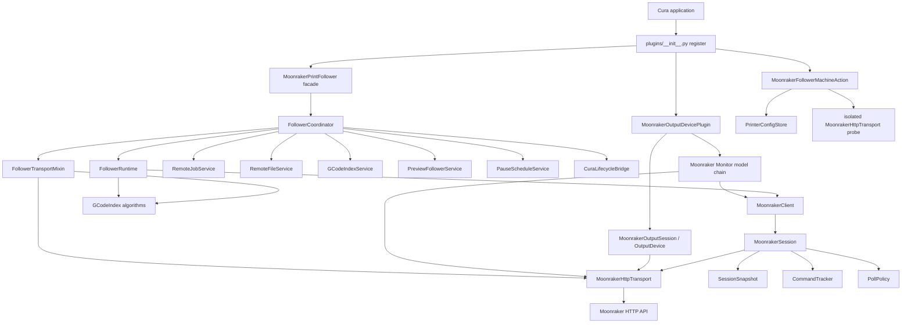
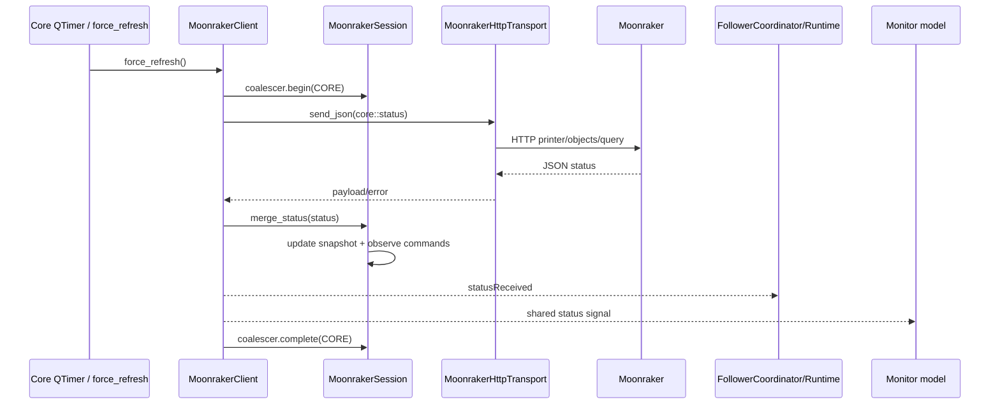
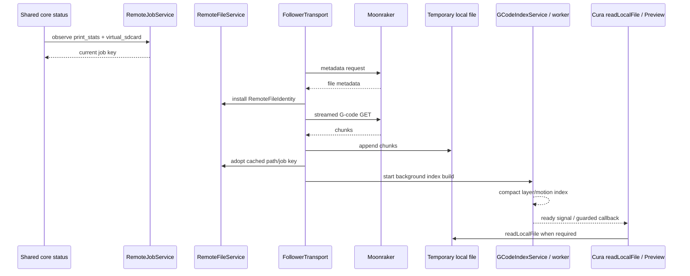

# Moonraker Print Follower architecture

This document is the canonical architectural guide for Moonraker Print Follower. It is intended to be useful both to human maintainers and to AI coding agents making future changes.

It documents not just **what files exist**, but **why boundaries exist, which component owns each kind of mutable state, how data moves through the plugin, which invariants must not be broken, and where new functionality should be added**.

Unless a later version explicitly changes these rules, new work should preserve the architecture described here.

---

## 1. Architectural goals

Moonraker Print Follower integrates three major capabilities into Cura:

1. **Live Preview following** — Cura's Preview follows a print already running through Klipper/Moonraker.
2. **Cura-to-Moonraker output** — Cura can upload G-code/UFP and optionally start a print.
3. **Live Monitor** — Cura exposes printer/job state, temperatures, fans, sensors, webcams, power controls and print controls.

The architecture is designed around several constraints:

- Cura's UI thread must remain responsive.
- Only the **currently active Cura printer** owns a live Moonraker session.
- All three feature areas must share connection identity and core printer state rather than polling the same data independently.
- The plugin remains **HTTP-only**. WebSockets are intentionally not part of the design.
- Large G-code files must not be loaded wholly into Python memory.
- Async work must be invalidated safely when the active Cura printer, scene, print job or credentials change.
- A successful HTTP response must not automatically be interpreted as proof that the printer reached the requested state.
- Mutable state must have one authoritative owner.
- New functionality should normally be added to a focused service or adapter rather than growing the legacy follower runtime.
- The source tree and packaged Marketplace artifact must remain deterministic and auditable.

This is primarily a **single-process, event-driven Qt architecture** with a small amount of background threading for G-code indexing/hydration.

---

## 2. Architectural laws

These are the most important rules for future development. Treat them as design constraints, not suggestions.

### 2.1 One owner for each mutable domain

Do not create two classes that both remember the same concept.

For example:

- remote print-run identity belongs to `RemoteJobService`;
- remote file/cache identity belongs to `RemoteFileService`;
- active G-code index/build/hydration state belongs to `GCodeIndexService`;
- Preview attachment and expected Preview position belong to `PreviewFollowerService`;
- scheduled end-of-layer pauses belong to `PauseScheduleService`;
- Cura lifecycle generation belongs to `CuraLifecycleBridge`;
- active Moonraker session state belongs to `MoonrakerSession` / `MoonrakerSessionState`.

Before adding a field to `FollowerCoordinator`, `FollowerRuntime`, a Monitor model or an output device, first ask whether an existing service already owns that concept.

### 2.2 One active Moonraker session per active Cura printer

Preview, Monitor and output share the active printer's `MoonrakerSession` and `MoonrakerHttpTransport`.

Do not add another active-printer `QNetworkAccessManager`, another core status poller, or another independent cache of core `printer/objects/query` state.

The intentional exception is an **unsaved connection probe**: testing candidate URL/API-key values must not rebind the live printer session. Those probes use a separate *instance* of the same `MoonrakerHttpTransport` implementation.

### 2.3 Core status is polled once

`MoonrakerClient` is the single core-status poller.

Monitor consumes the resulting shared status stream. Preview consumes the same stream. Output may use that shared state as readiness evidence.

If a feature needs an object that logically belongs in core status, extend the core query rather than creating a second fast poller.

### 2.4 Use the shared HTTP transport

Ordinary JSON Moonraker requests should go through `MoonrakerHttpTransport.send_json()`.

Large streaming downloads and multipart uploads may manage their own `QNetworkReply` lifecycle, but they must still use the shared transport's request builder and `QNetworkAccessManager` for the active printer.

Do not duplicate authentication-header creation, timeout handling, JSON decoding, request cancellation or connection pooling.

### 2.5 HTTP acceptance is not state confirmation

For commands whose success is observable in printer state, distinguish:

1. command issued;
2. Moonraker accepted the HTTP request;
3. the shared status stream observed the expected printer state.

Use `CommandTracker` for this pattern.

### 2.6 Never block Cura's UI thread

Do not add `sleep()`, synchronous HTTP, busy waiting, or large synchronous file processing to a Cura/Qt callback.

Use:

- Qt network replies for HTTP;
- `QTimer` for retry/delay scheduling;
- worker threads for heavy G-code indexing/hydration;
- Qt signals or lifecycle-guarded callbacks to return results to the UI side.

### 2.7 Every async result needs an identity or generation guard

A reply can become stale because:

- the active Cura printer changed;
- URL/API key changed;
- a new print of the same filename started;
- a G-code file changed;
- Cura replaced the scene/toolpath;
- a newer request superseded an older request.

Use the relevant transport generation, lifecycle generation, job key, request generation and/or file identity before applying an async result.

### 2.8 QML is presentation, not transport/business logic

QML should bind to model properties and invoke exposed actions. It must not grow Moonraker protocol logic, polling policy or hidden state machines.

### 2.9 `FollowerRuntime.py` is a compatibility boundary, not the preferred home for new domain logic

`FollowerRuntime.py` still contains much of the mature Cura-facing implementation inherited from the pre-rearchitecture follower. Some historical method bodies and private attributes remain because the refactor is deliberately incremental.

`FollowerCoordinator` and `FollowerTransportMixin` override or redirect service-owned responsibilities.

**New domain logic should not be added to `FollowerRuntime.py` merely because related old code is there.** Put it in the appropriate service/adapter and have the coordinator bridge it into the runtime when necessary.

### 2.10 Preserve graceful degradation

Moonraker/Klipper installations differ. Optional objects and APIs must degrade cleanly.

Examples:

- `motion_report` is optional;
- explicit current-layer data is optional;
- webcam discovery may be unavailable;
- metadata may be incomplete;
- some heaters/fans/sensors may not exist.

Prefer capability detection over assuming a particular printer configuration.

---

## 3. High-level component model



The important shape is:

- **Cura-facing coordination at the top**;
- **focused state owners in the middle**;
- **one shared active-printer Moonraker session/transport beneath Preview, Monitor and output**;
- **pure algorithms separated from live Qt state where practical**.

---

## 4. Plugin startup and dependency wiring

Cura enters the plugin through `plugins/__init__.py`.

`register(app)` performs the top-level composition:

1. Construct `MoonrakerPrintFollower(app)`.
2. Attempt one-time migration of compatible settings from the old standalone Moonraker Connection plugin.
3. Construct `MoonrakerOutputDevicePlugin(app, follower)` using the same follower instance.
4. Construct `MoonrakerFollowerMachineAction(app, follower, output_plugin)`.
5. Return the Cura plugin objects:
   - `extension`;
   - `output_device`;
   - `machine_action`.

This dependency injection is important. The output and Monitor paths receive the same follower object and therefore the same active `MoonrakerClient` / `MoonrakerSession`.

Do not make Monitor or output discover/reconstruct a separate follower/session from global state.

### Startup dependency graph

```text
Cura
 └─ register(app)
     ├─ MoonrakerPrintFollower
     │   └─ FollowerCoordinator
     │       ├─ domain services
     │       ├─ FollowerRuntime
     │       └─ MoonrakerClient
     │           └─ MoonrakerSession
     │               └─ MoonrakerHttpTransport
     ├─ MoonrakerOutputDevicePlugin(follower)
     │   ├─ output device(s)
     │   └─ Monitor model(s)
     └─ MoonrakerFollowerMachineAction(follower, output plugin)
```

---

## 5. Public follower facade and compatibility layering

### `MoonrakerPrintFollower.py`

This is intentionally tiny. It is the public Cura-facing class name expected by the plugin startup path and delegates implementation to `FollowerCoordinator`.

Do not turn it back into an implementation file.

### `FollowerCoordinator.py`

The coordinator is the composition and orchestration layer. It:

- creates the focused domain services before the compatibility runtime is initialised;
- bridges historical runtime private attributes into service-owned state using properties;
- coordinates active-printer session startup/shutdown;
- applies job/file/index invalidation rules;
- integrates the Preview service and pause schedule service with the runtime;
- owns lifecycle-aware dispatch into delayed Cura callbacks.

The coordinator may coordinate multiple services, but it should not become a new monolith. If a coherent stateful responsibility grows beyond orchestration, extract it into its own service.

### `FollowerRuntime.py`

This is the large compatibility runtime containing mature Cura scene/QML/load/following mechanics.

It still contains a significant amount of historical implementation. During the strangler refactor, service-backed properties and method overrides allow the new architecture to become authoritative without rewriting all mature behavior simultaneously.

Rules for future work:

- Prefer service modules for state/policy.
- Prefer `FollowerTransport.py` for follower-specific Moonraker transport operations.
- Prefer `CuraAdapter.py` / `CuraLifecycleBridge.py` for Cura boundary concerns.
- Only add code directly to `FollowerRuntime.py` when the behavior is genuinely tightly coupled to Cura's existing runtime lifecycle and no focused boundary is more appropriate.
- When touching an old runtime method whose responsibility is already extracted, remove or redirect the old implementation rather than creating another parallel path.

### `FollowerTransport.py`

`FollowerTransportMixin` owns follower-specific Moonraker I/O that does not belong in the generic core poller:

- explicit status probes/load requests;
- metadata lookup;
- streamed G-code download;
- scheduled PAUSE command transport and acknowledgement bridging.

For the active printer it uses the shared `MoonrakerClient.transport`.

For an alternate/unsaved target it may create an isolated probe transport so the live session is not rebound.

---

## 6. Configuration model

### `PrinterConfig`

`PrinterConfig.py` defines the complete persisted per-Cura-printer configuration.

Settings are grouped conceptually into:

#### Live follower settings

- `enabled`
- `url`
- `api_key`
- `poll_interval_ms`
- `moonraker_layer_is_one_based`
- `auto_preview`
- `z_fallback`
- `z_tolerance`
- `path_follow`
- `show_toolhead_indicator`
- `follow_mode`

#### Upload/output settings

- frontend URL;
- output format;
- upload dialog/default path/history;
- start-print behavior;
- remembered upload state;
- success-message behavior;
- configured power devices;
- ready retry interval;
- filename translation/removal.

#### Monitor/webcam fallback settings

Modern webcam configuration is discovered from Moonraker. Persisted camera fields exist primarily for compatibility/fallback.

### `PrinterConfigStore`

The store persists configuration by Cura machine ID under one JSON preference mapping.

This gives the plugin an important invariant:

> Configuration belongs to a Cura machine, not to the plugin globally.

Changing Cura's active machine changes which configuration becomes active.

### Migration

The store supports two migration paths:

1. old global Moonraker Print Follower settings → current Cura printer;
2. compatible standalone Moonraker Connection settings → per-printer integrated configuration.

Migration must remain non-fatal. Plugin startup must not fail because old preference data is malformed or Cura has not yet established a usable machine identity.

### Adding a new persistent setting

When adding a setting:

1. Add a typed/defaulted field to `PrinterConfig`.
2. Update `PrinterConfig.from_dict()` normalization/validation.
3. Add UI exposure in the Machine Action/QML if user-configurable.
4. Ensure old stored dictionaries still deserialize safely by relying on defaults.
5. Add migration only if a semantically equivalent old setting exists.
6. Add tests for defaulting, persistence and per-printer isolation.

Do not add a separate preference key for a setting that belongs in the per-printer configuration model.

---

## 7. Active-printer ownership

The plugin supports multiple configured Cura printers but only one live runtime binding at a time: Cura's currently active printer.

A machine switch is an identity boundary, not a cosmetic UI change.

When the active printer changes, stale work from the previous printer must not leak into the new printer. Relevant state includes:

- core status snapshot;
- Moonraker connection identity;
- transport requests;
- print-run identity;
- remote file identity;
- local G-code cache;
- index and hydration work;
- scheduled pauses;
- Preview expectations;
- delayed Cura callbacks.

The architecture uses cancellation plus generation/job/file identity guards so that a late callback from printer A cannot mutate printer B's state.

---

## 8. Moonraker session architecture

### `MoonrakerSessionState`

This is the pure, Qt-independent state/policy core. It contains:

- `PollPolicy`;
- `RequestCoalescer`;
- `SessionSnapshot`;
- `CommandTracker`;
- generation;
- base URL;
- connection state;
- pause-precision guard.

Keeping this state pure makes deterministic unit testing possible without creating Qt network objects.

### `MoonrakerSession`

This binds the pure state to a live transport and adds the active connection identity:

- base URL;
- API key;
- `MoonrakerHttpTransport`.

A URL or API-key change is a full session rebind.

Rebinding:

1. reconfigures the transport;
2. cancels all pending transport owners;
3. resets the shared session state;
4. changes the connection identity atomically from the plugin's perspective.

API-key changes are treated exactly like URL changes because data obtained using old credentials must not remain authoritative after rebinding.

### `MoonrakerClient`

The client owns the **single core poll loop**.

Responsibilities:

- start/stop polling;
- core `printer/objects/query` request;
- retry/backoff behavior;
- core request coalescing;
- merging returned status into `SessionSnapshot`;
- deriving discovered capabilities;
- emitting status/connection/capability/command signals;
- applying state-aware core polling intervals;
- triggering immediate refresh after accepted commands.

It is deliberately not the home for Monitor-specific peripheral queries, upload logic or G-code streaming.

---

## 9. Shared HTTP transport

### `MoonrakerHttpTransport`

This is the reusable Qt HTTP primitive for Moonraker requests.

It owns:

- one `QNetworkAccessManager` / connection pool;
- base URL and API key;
- standard headers;
- request timeout setup where supported by the Cura Qt version;
- JSON body encoding;
- JSON response decoding;
- Moonraker error handling;
- request serial IDs;
- transport generation;
- owner/channel request slots;
- cancellation;
- transport metrics and correlated debug logging.

### Owner/channel model

Ordinary JSON requests are identified by:

```text
owner::channel
```

Examples conceptually include:

```text
core::status
monitor::power
monitor::system
output:<machine-id>::json
follower::metadata
follower::scheduled-pause
```

This prevents unrelated consumers from cancelling each other while still making replacement/cancellation deterministic within one logical lane.

When `replace=False`, an already-running request for the same owner/channel is not duplicated.

When `replace=True`, the old request is cancelled before the replacement is issued.

### Transport generation

Changing URL/API key increments the transport generation and cancels all requests. A reply from an older generation is discarded.

### Metrics and logging

Metrics are grouped by request category and record:

- started count;
- completed count;
- failed count;
- aggregate/average elapsed time.

Debug log entries include a request ID, category, channel, HTTP method, elapsed time and outcome.

When adding networking observability, extend this shared mechanism rather than creating feature-specific timing logs unless feature context genuinely requires it.

---

## 10. Polling policy

`PollPolicy` categorizes requests by how quickly the information changes and how expensive it is to refresh.

| Category | Purpose | Current policy |
| --- | --- | --- |
| `CORE` | print state, file position, core live status | configured interval while printing |
| `CORE` + pause guard | precision around scheduled end-of-layer PAUSE | min(configured interval, 250 ms) |
| `CORE` paused | core state while printer paused | at least 1500 ms |
| `CORE` idle | core state when not printing/paused | at least 5000 ms |
| `AUXILIARY` active | temperatures/fans/volatile Monitor data | 1000 ms |
| `AUXILIARY` idle | same, while idle | 2500 ms |
| `POWER` | Moonraker power devices | 5000 ms |
| `SYSTEM` | host/Klippy/MCU system information | 10000 ms |
| `DISCOVERY` | webcams, objects, static capabilities/config | 30000 ms |
| `COMMAND` | user/automation commands | event-driven, not periodic |
| `STATIC` | metadata/static file information | event-driven |

These values are policy, not UI constants. New polling behavior should be represented in `PollPolicy` rather than scattered timer literals.

### Why polling is adaptive

Fast polling is useful during active motion but wasteful while idle. Some resources such as webcams/configuration change rarely. Scheduled end-of-layer PAUSE needs temporarily tighter core polling to minimize overshoot after crossing the target layer.

Do not solve a latency problem by globally reducing every timer.

---

## 11. Core status data flow



### `SessionSnapshot`

The snapshot merges object patches by object name. It is the canonical shared view of the latest core status known to the plugin.

It tracks:

- merged status dictionary;
- revision;
- update timestamp;
- derived `printer_state` from `print_stats.state`.

Consumers should avoid maintaining independent copies of the same core fields unless they are deliberately transformed presentation state.

### Request coalescing

If several parts of the plugin ask for a forced core refresh while one is already in flight, the coalescer records at most one pending follow-up.

This prevents bursts such as:

```text
user action -> refresh
power-on -> refresh
Monitor refresh -> refresh
command acceptance -> refresh
```

from creating four simultaneous core requests.

---

## 12. Command acknowledgement

`CommandTracker` separates transport success from device-state success.

A tracked command progresses conceptually through:

```text
pending -> accepted -> confirmed
                 \-> timed_out
pending/accepted -> failed
```

A command may define expected `print_stats.state` values.

Examples:

| Command | Expected confirmation state |
| --- | --- |
| Pause | `paused` |
| Resume | `printing` |
| Cancel | `cancelled`, `complete` or `standby` |
| Scheduled PAUSE | `paused` |

The shared status merge calls `CommandTracker.observe()`, allowing command confirmation to happen from the same authoritative status stream used by Preview and Monitor.

### Adding a new command

Use state acknowledgement when the command has a meaningful observable result.

Recommended sequence:

1. `track_command(name, expected_states)` before issuing HTTP.
2. Send through the shared transport with `RequestCategory.COMMAND`.
3. On HTTP error: `fail_command()`.
4. On HTTP success: `accept_command()`.
5. Trigger a core refresh if appropriate.
6. Let shared status confirm the state.
7. Surface timeout/failure distinctly from HTTP acceptance.

Do not display “completed” merely because Moonraker returned HTTP success if the command is supposed to change printer state.

---

## 13. Remote job identity

### `RemoteJobService`

The service distinguishes a **print run** from a **filename**.

This matters because users frequently reprint the same file and Moonraker can retain `print_stats` after completion.

A job key is effectively:

```text
(filename, file_size, monotonically increasing run serial)
```

A new run can be detected from signals including:

- filename change;
- size change;
- transition from inactive to active state;
- file-position rewind;
- print-duration rewind.

The serial prevents stale cache/index state for an earlier print of the same file from being accepted as current.

### Rule

Any async work whose result is specific to a print run should carry/check the current job key.

Do not use filename alone as print identity.

---

## 14. Remote file identity and cache

### `RemoteFileService`

This service owns:

- `RemoteFileIdentity` from Moonraker metadata;
- which job key that metadata belongs to;
- cached local G-code filename/path;
- cached local G-code job key.

### `RemoteFileIdentity`

Defined in `Core.py`, file identity includes:

- filename;
- size;
- modification time;
- UUID when Moonraker provides one.

Its stable key prefers UUID and otherwise falls back to filename/size/modified time.

This is distinct from print-run identity:

- **job key** answers “which execution of a print is this?”;
- **file identity** answers “which exact remote file contents are these?”

Both are needed.

### Cache lifetime

Downloaded G-code is kept long enough for Cura's asynchronous `readLocalFile()` lifecycle. Do not delete a file merely because the initial call to `readLocalFile()` has returned.

When replacing a cache entry, cleanup must respect any Cura load still in progress.

---

## 15. G-code indexing architecture

### `GCodeIndex.py`

This module contains parsing/indexing algorithms and data structures. It should remain as independent from Cura/Qt runtime state as practical.

Responsibilities include:

- layer-range discovery;
- motion-command offsets;
- timing/motion metadata;
- slicer marker interpretation;
- persistent index serialization/validation;
- lazy layer hydration;
- mapping explicit `CURRENT_LAYER` values where present.

### `GCodeIndexService.py`

This service owns the live lifecycle of an index:

- installed index filename/job key;
- layer ranges;
- motion offsets;
- current-layer map;
- full `LayerMotionIndex` data;
- build filename/job key;
- build cancellation event;
- build thread;
- hydration-in-progress set;
- hydration threads;
- index generation.

The distinction is intentional:

> `GCodeIndex.py` knows how to build/query an index. `GCodeIndexService.py` knows which index/build/hydration is currently authoritative.

Do not move Qt/Cura lifecycle state into the parsing module.

---

## 16. Large G-code pipeline

Large remote G-code files are streamed to disk and indexed without loading the full file into Python memory.



### Lazy hydration

For large files the compact index avoids retaining all detailed motion data at once. Detailed data for a layer is hydrated only when needed.

Hydration is deduplicated per layer and tracked by `GCodeIndexService`.

### Transition behavior

The next layer may be prepared ahead of a transition. If detailed path information is not ready, Preview should prefer holding a stable position over showing a coarse estimate that later jumps backwards.

Monotonic display behavior is a user-visible correctness requirement, not merely a cosmetic optimization.

---

## 17. Layer resolution and Preview following

The follower needs to map Moonraker state onto Cura's zero-based Preview layer model.

Layer information may come from several sources, depending on what the printer/file exposes. The implementation favors stronger/self-describing signals and falls back when unavailable, including:

- explicit/current-layer information mapped from the active G-code;
- indexed `virtual_sdcard.file_position` against G-code layer ranges;
- configured Z-height fallback.

All consumers that display a “current layer” should use the same interpretation rather than inventing separate numbering logic.

### `FollowController.py`

`FollowController` is the small explicit state machine for follower intent.

States include:

- disabled;
- disconnected;
- connecting;
- idle;
- following;
- user override;
- remote paused;
- Cura suspended;
- error.

It also contains pure follow-mode decisions.

Current follow modes are:

- `exact` — current remote layer, path following allowed;
- `completed` — previous completed layer;
- `lookahead` — one layer ahead;
- `window` — a range around the remote layer.

### Separation of responsibility

- `FollowController` decides *what layer range should be shown*.
- `PreviewFollowerService` owns attachment/expected-position state.
- Cura adapter/runtime code performs the actual SimulationView interaction.

---

## 18. Preview attachment and manual override

### `PreviewFollowerService`

This service owns:

- whether following is currently detached by the user;
- the layer/path position most recently written by the follower;
- expected minimum/current layer handles;
- expected minimum/current path handles;
- manual-override classification.

Cura exposes two independently movable handles for layers and paths. The follower therefore tracks both upper/current and lower/minimum values.

### Manual override rule

While automatic following is attached, a user-visible deviation from the position last written by the plugin is interpreted as manual control and detaches following.

The plugin must not immediately fight the user by snapping the Preview controls back.

### Internal writes versus user writes

Follower-originated Preview changes must establish the new expected position. Manual-change detection must be suppressed during the plugin's own update and during Cura lifecycle windows where Preview is being replaced/rebuilt.

---

## 19. Scheduled end-of-layer PAUSE

### `PauseScheduleService`

Scheduled pause layers are **print-local**, zero-based runtime state. They are deliberately not persisted in `PrinterConfig`.

A scheduled target is due only once Moonraker advances to a strictly later layer:

```text
target = N
current = N       -> not due
current = N + 1   -> due
```

This ensures “pause after layer N” does not become “pause at the start of layer N”.

### Precision polling guard

When a scheduled pause is imminent, the coordinator enables the session pause guard. Core polling temporarily tightens, currently to no slower than 250 ms unless the user's configured interval is already faster.

The guard is removed when no longer required.

### Command acknowledgement

The scheduled PAUSE is sent through `FollowerTransport` and tracked through the shared `CommandTracker`.

HTTP acceptance means only that Moonraker accepted the G-code script request. The operation is confirmed only when shared core status reports `paused`.

### Safety rules

Scheduled pauses must be cleared/invalidated when the print-run identity changes. A pause scheduled for one file/run must never carry into another print.

---

## 20. Cura lifecycle and stale-work protection

### `CuraLifecycleBridge`

The bridge owns a monotonically increasing Cura lifecycle generation.

Delayed callbacks capture a token. Before mutating current state they verify that the token still matches the active generation.

Lifecycle invalidation is used when Cura context changes in a way that makes pending work unsafe.

### Why this is separate from transport generation

Transport generation answers:

> “Does this HTTP reply belong to the current URL/API-key binding?”

Cura lifecycle generation answers:

> “Does this callback belong to the current Cura scene/toolpath lifecycle?”

Job key answers:

> “Does this result belong to the current print run?”

File identity answers:

> “Does this result belong to the current remote file contents?”

These identities solve different stale-result problems and should not be collapsed into one vague global counter.

---

## 21. Concurrency model

### Qt/UI thread

The following are primarily event-driven on Cura's Qt thread:

- network request creation/completion callbacks;
- timers;
- QML/model property changes;
- Cura scene/view interaction;
- output-device lifecycle events.

Keep these callbacks short.

### Worker threads

G-code indexing and layer hydration may run on Python worker threads because file parsing can be expensive.

Worker-thread rules:

- do not directly mutate Cura UI/scene objects from the worker;
- carry generation/job/file identity into the work;
- use cancellation events for superseded builds;
- marshal completion back through the existing signal/callback path;
- verify authority again before installing the result.

### Qt timers

Use `QTimer` for:

- polling;
- command confirmation refreshes/timeouts;
- delayed readiness checks;
- lifecycle-settle windows;
- manual Preview change observation.

Do not replace timer-driven behavior with `sleep()`.

---

## 22. Monitor architecture

The Monitor model is layered through inheritance so each concern can extend the previous one.

Current conceptual chain:

1. `MoonrakerMonitorModel.py`
   - generic Monitor state;
   - field parsing;
   - capabilities/peripheral data;
   - power/system/webcam support;
   - base request hooks.
2. `MoonrakerMonitorSession.py`
   - forces the Monitor onto the shared core client and shared active-printer transport;
   - disables the duplicate core timer;
   - categorizes peripheral requests;
   - applies adaptive polling policy;
   - integrates command acknowledgement for Pause/Resume/Cancel.
3. `MoonrakerMonitorRuntime.py`
   - follower-aware runtime interpretation, especially physical/current layer resolution.
4. `MoonrakerMonitorControls.py`
   - printer actions/live tuning and control behavior.
5. `MoonrakerMonitorTypedControls.py`
   - typed macro controls, PWM/MCU-related presentation, remembered webcams and additional richer controls.

The active QML presentation chain is built on the Monitor dashboard QML files, including `MoonrakerMonitor.qml`, `MoonrakerMonitorDashboard.qml` and bed-mesh presentation.

### Core versus peripheral data

Core status must come from `MoonrakerClient`.

Peripheral Monitor data can use separate categorized requests because it either:

- is not present in the core query; or
- changes at a different cadence.

### Important compatibility detail

The base Monitor model historically creates its own network manager. `MoonrakerMonitorSession` replaces the effective manager/request path with the shared transport and suppresses the base core timer.

Future code must use the session layer's request abstraction. Do not add direct network traffic to the base model that bypasses `_json_request()` / shared transport.

### Adding Monitor data

Decide first which class owns the datum:

- part of core status → extend core query/parsing and consume shared snapshot;
- fast dynamic peripheral → `AUXILIARY` lane;
- power state → `POWER` lane;
- host/Klippy/MCU system information → `SYSTEM` lane;
- object/config/webcam discovery → `DISCOVERY` lane.

Then add model properties/signals and QML presentation separately.

---

## 23. Output/upload architecture

### `MoonrakerOutputDevicePlugin.py`

This integrates Moonraker as a Cura output destination for the active configured Cura printer and supplies the Monitor view/model.

It must remain bound to the same follower/configuration identity as Preview.

### Output class layering

The output implementation is split conceptually across:

- `MoonrakerOutputDevice.py` — writing, Moonraker upload/power/readiness behavior, multipart upload and user-facing result handling;
- `MoonrakerOutputDeviceLifecycle.py` — Cura write-lifecycle correctness for success/failure/cancellation;
- `MoonrakerOutputSession.py` — shared active-printer session/transport integration.

### Shared transport

`MoonrakerOutputSession`:

- reuses the active `MoonrakerHttpTransport` for JSON requests;
- reuses the shared `QNetworkAccessManager` for multipart upload;
- uses a transport owner keyed by machine ID;
- cancels its owner requests during cleanup.

### Readiness

If the shared client is connected and already has valid `print_stats`, output treats that core status as strong evidence that Klippy is ready and can proceed without issuing a duplicate readiness request.

When shared evidence is unavailable, the underlying output readiness mechanism remains available as fallback.

### Output rules

- Upload-only behavior should not unnecessarily require printer readiness when Moonraker's file service can still accept files.
- Immediate-print behavior may require Klippy readiness.
- Power-on/wait flows must be timer-driven and non-blocking.
- Cancelling a Cura upload dialog must cleanly terminate the Cura write lifecycle without leaving the output device wedged busy.
- Multipart upload is a specialized streaming operation; it may own a reply lifecycle but must share the active transport's network manager/request identity.

---

## 24. Machine Action and settings UI

### `MoonrakerFollowerMachineAction.py`

This is the backend for Cura's **Configure Moonraker** Machine Action.

It exposes per-printer settings to `MoonrakerFollowerConfiguration.qml`, validates values and writes through `PrinterConfigStore`.

### Connection test

The connection-test UI is intentionally different from normal live operations.

A user may type URL/API-key values that have not been saved. Testing them must not tear down or rebind the current live printer session.

Therefore connection testing uses a separate `MoonrakerHttpTransport` instance.

This is an **isolated session instance**, not a second transport implementation.

When adding more connection diagnostics, extend the shared transport/protocol primitives and keep the probe isolated from the live session identity.

---

## 25. Protocol and adapter modules

### `MoonrakerProtocol.py`

This is the preferred home for Moonraker endpoint construction and protocol-level transformations.

Do not scatter URL string concatenation across feature code when an endpoint helper belongs here.

Protocol helpers should ideally remain easy to unit test.

### `CuraAdapter.py`

Contains focused Cura compatibility helpers such as:

- active machine identity;
- Preview writes;
- mapping to Cura's toolpath representation.

Put small reusable Cura API adaptation here rather than teaching domain services about Cura internals.

### `NativeNozzleFallback.py`

Contains compatibility behavior for Cura's native SimulationView nozzle lifecycle during live following.

The plugin deliberately prefers Cura's native nozzle representation rather than maintaining a separate competing nozzle model.

### `DownloadStream.py`

Contains bounded local streaming support used by remote G-code download.

### `Core.py`

Contains small shared primitives that do not belong to a stateful service, currently including:

- `OperationPhase`;
- `OperationContext`;
- `RemoteFileIdentity`;
- end-of-layer pause due calculation;
- Preview manual-override classification primitive.

Do not turn `Core.py` into a generic dumping ground. A primitive belongs there only if it is small, cohesive and genuinely shared.

---

## 26. Operation lifecycle

`OperationContext` consolidates the follower's remote-file/Cura-load operation lifecycle.

Current phases are:

```text
IDLE
RESOLVING
DOWNLOADING
CURA_LOADING
INDEXING
READY
ERROR
```

The context may also carry:

- filename;
- job key;
- force-load intent;
- local path;
- start time;
- message.

Use this operation state rather than introducing another cluster of booleans describing the same long-running workflow.

---

## 27. File/module ownership map

This table is the quickest answer to “where should this change go?”.

| Module | Primary responsibility | Should not own |
| --- | --- | --- |
| `__init__.py` | Cura plugin composition/registration | feature logic |
| `MoonrakerPrintFollower.py` | public follower facade | implementation/state |
| `FollowerCoordinator.py` | cross-service orchestration and compatibility bridges | large standalone domain logic |
| `FollowerRuntime.py` | remaining mature Cura-facing runtime mechanics | new transport/state services |
| `FollowerTransport.py` | follower-specific Moonraker I/O | generic core polling or UI presentation |
| `MoonrakerClient.py` | single core poller, connection/backoff/capabilities | Monitor peripheral/UI logic |
| `MoonrakerSession.py` | active connection identity, shared state/policy/command acknowledgement | Cura UI |
| `MoonrakerTransport.py` | reusable Qt HTTP mechanics/connection pool | feature semantics |
| `RemoteJobService.py` | print-run identity/restart detection | remote file contents |
| `RemoteFileService.py` | remote file identity/local cache | G-code parsing |
| `GCodeIndex.py` | pure G-code index algorithms/data | live Cura state |
| `GCodeIndexService.py` | active index/build/hydration lifecycle | parser implementation |
| `PreviewFollowerService.py` | Preview attachment/expected position/manual override | Moonraker transport |
| `PauseScheduleService.py` | print-local scheduled pause set/due logic | HTTP command lifecycle |
| `CuraLifecycleBridge.py` | Cura generation tokens/stale callback protection | Moonraker connection identity |
| `FollowController.py` | follower state machine/follow-mode decision | transport or Cura object mutation |
| `PrinterConfig.py` | per-machine settings/defaulting/migration | runtime print-local state |
| `MoonrakerFollowerMachineAction.py` | settings UI backend/connection probe | active live session ownership |
| `MoonrakerProtocol.py` | endpoint/protocol helpers | feature state |
| `CuraAdapter.py` | focused Cura API adaptation | Moonraker policy |
| `NativeNozzleFallback.py` | native Cura nozzle compatibility | independent nozzle rendering model |
| `DownloadStream.py` | bounded stream-to-disk helper | job/index ownership |
| `MoonrakerOutputDevicePlugin.py` | Cura output-device registration/Monitor integration | HTTP primitive implementation |
| `MoonrakerOutputDevice.py` | output/upload behavior | separate active connection pool |
| `MoonrakerOutputDeviceLifecycle.py` | Cura output completion/cancellation lifecycle | protocol/state ownership |
| `MoonrakerOutputSession.py` | shared-session adaptation for output | duplicate core status polling |
| `MoonrakerMonitorModel.py` | generic Monitor model/parsing/peripherals | independent core poller in active architecture |
| `MoonrakerMonitorSession.py` | shared session/transport/poll policy/command ack | QML presentation |
| `MoonrakerMonitorRuntime.py` | follower-aware Monitor runtime interpretation | generic HTTP transport |
| `MoonrakerMonitorControls.py` | printer controls/live tuning | connection ownership |
| `MoonrakerMonitorTypedControls.py` | richer typed Monitor controls | core session replacement |
| `BedMeshSceneNode.py` | Cura scene representation for bed mesh | Moonraker polling |
| QML files | presentation and user interaction | networking/business state machines |

---

## 28. Adding new functionality: decision guide

### 28.1 Adding a new Moonraker status field

Ask whether it belongs in core status.

If yes:

1. Extend the core query/protocol representation.
2. Let `MoonrakerClient` merge it into the shared snapshot.
3. Consume it from Preview/Monitor as needed.
4. Add capability detection if optional.
5. Add deterministic tests.

Do **not** create another timer asking Moonraker for the same object.

### 28.2 Adding a new Monitor-only peripheral

1. Decide request category based on volatility/cost.
2. Route through `MoonrakerMonitorSession._json_request()`.
3. Reuse capability discovery where possible.
4. Add model state/signals in the appropriate Monitor layer.
5. Add QML presentation separately.
6. Ensure inactive/non-active printers cannot keep polling.

### 28.3 Adding a new Moonraker command

1. Add/centralize endpoint construction in `MoonrakerProtocol.py` where appropriate.
2. Send through shared transport as `COMMAND`.
3. If success is observable, register expected state with `CommandTracker`.
4. Distinguish accepted/confirmed/failed/timed-out in UI state.
5. Generation/job guard callbacks if command semantics are print-specific.

### 28.4 Adding new follower state

First identify the owner.

- job-run semantics → `RemoteJobService`;
- file/cache semantics → `RemoteFileService`;
- index lifecycle → `GCodeIndexService`;
- Preview attachment/expectation → `PreviewFollowerService`;
- pause schedule → `PauseScheduleService`;
- Cura lifecycle token → `CuraLifecycleBridge`;
- connection/shared status → `MoonrakerSession`.

If none fit and the state forms a coherent new domain, create one focused service. Do not add parallel state to both coordinator and runtime.

### 28.5 Adding a new G-code-derived feature

If it is a parsing/math operation, prefer `GCodeIndex.py` or another pure algorithm module.

If it is live ownership of build/cache/hydration state, use `GCodeIndexService` or `RemoteFileService`.

Keep worker threads independent from Cura objects.

### 28.6 Adding a new persistent option

Use the `PrinterConfig` procedure in section 6. Do not persist print-local transient state.

### 28.7 Adding a new upload behavior

Decide whether it is:

- Cura write lifecycle → `MoonrakerOutputDeviceLifecycle`;
- Moonraker upload/power/readiness semantics → output device behavior;
- shared request/session concern → `MoonrakerOutputSession` / `MoonrakerSession`;
- new endpoint formatting → `MoonrakerProtocol`.

### 28.8 Adding new QML

Keep model logic in Python. QML may:

- display properties;
- derive simple visual presentation;
- invoke exposed slots/actions.

QML should not:

- construct Moonraker URLs;
- decide polling intervals;
- maintain hidden copies of job identity;
- infer authoritative printer state independently of the model.

---

## 29. Anti-patterns to reject during review

Reject or redesign a change if it introduces any of these without a compelling architectural reason:

- a new active-printer `QNetworkAccessManager`;
- a second fast/core status timer;
- direct HTTP from QML;
- `sleep()` on a Cura callback path;
- filename-only print identity;
- a second scheduled-pause set;
- a second Preview “expected position” cache;
- a second active G-code index cache;
- state duplicated in both `FollowerRuntime` and a service;
- HTTP 200 treated as confirmed printer state when confirmation is observable;
- async callback applying data without checking relevant generation/job/file identity;
- hard-coded printer object assumptions instead of capability detection;
- feature-specific copies of API-key/header/JSON parsing code;
- persistent storage for state that is inherently tied to one running print;
- a generic helper/service whose only purpose is to wrap another class with the same responsibility.

The duplicate-wrapper problem is specifically guarded by source-contract tests because it previously appeared during the v3.1 rearchitecture.

---

## 30. Testing architecture

Tests live under `tests/` and are discovered with standard-library `unittest`.

The test strategy deliberately combines several levels.

### Pure logic tests

Use these for deterministic behavior such as:

- follow-mode decisions;
- job restart detection;
- pause due calculation;
- polling policy;
- request coalescing;
- command acknowledgement/timeout;
- file/index parsing;
- identity comparison.

### Fake Moonraker tests

`tests/fake_moonraker.py` provides deterministic scripted status progression without sockets, threads or wall-clock dependency.

It is used for scenarios such as:

- shared snapshot progression;
- command confirmation;
- scheduled-pause flow;
- long-print state progression;
- same-filename print restart.

When a new state-machine/polling feature can be expressed without real Qt networking, extend this level first.

### Source-contract tests

Source contracts enforce architectural and Cura compatibility invariants that are difficult to instantiate in a headless CI environment.

Examples include:

- one authoritative service per extracted domain;
- no obsolete duplicate service files;
- HTTP-only transport;
- shared Monitor/output transport patterns;
- required Cura APIs and safety calls;
- package ID/version metadata;
- absence of private network addresses/API keys;
- QML placement/structural rules.

Source contracts should not replace behavioral tests when code can be tested directly. They are best used to stop architectural regression.

### G-code fixture tests

Use representative slicer files/fixtures to cover:

- Cura markers;
- PrusaSlicer/SuperSlicer/OrcaSlicer markers;
- `SET_PRINT_STATS_INFO` mappings;
- compact indexes;
- lazy hydration;
- timing/motion behavior.

### CI matrix

CI currently verifies Python source compilation on:

- Python 3.10;
- Python 3.11;
- Python 3.12.

Release tests also run:

- QML structural sanity;
- all discovered tests;
- package metadata checks;
- `.curapackage` build;
- exact source/package parity;
- Marketplace source ZIP build and layout verification;
- CI artifact upload.

---

## 31. Release and packaging invariants

The canonical Cura/Marketplace package ID is:

```text
Moonraker_Print_Follower
```

Do not reintroduce the historical no-underscore package-ID variant.

Release/package requirements include:

- package and plugin version metadata agree;
- supported Cura SDK declarations remain intentional;
- `.curapackage` is an exact projection of the intended plugin source tree;
- no `__pycache__`, `.pyc`, editor backups, patch files or development debris;
- Marketplace source ZIP layout is validated;
- license/changelog remain present and current;
- runtime source must not contain hard-coded private printer addresses or literal API keys.

Architecture changes that affect package structure must update the packaging tests in the same change.

---

## 32. Observability and debugging

### Transport

`MoonrakerHttpTransport` is the primary place for request-level observability.

Use its correlated request IDs/categories/elapsed-time metrics before adding new request timing infrastructure.

### Runtime status

User-facing status should distinguish meaningful states such as:

- connecting/disconnected;
- following/detached;
- downloading/indexing/loading;
- command accepted but awaiting confirmation;
- command confirmed;
- command failed/timed out.

Avoid collapsing these into vague success/failure strings when the distinction matters operationally.

### Debugging stale-state bugs

When investigating “wrong printer”, “old print”, “jumped backwards”, or “late callback” bugs, inspect these identities separately:

1. active Cura machine ID;
2. Moonraker session/transport generation;
3. Cura lifecycle generation;
4. remote job key;
5. remote file identity;
6. G-code index generation;
7. request owner/channel/generation.

Most cross-lifecycle bugs are a mismatch in one of these dimensions.

---

## 33. Known transitional debt

The architecture is intentionally safer than a ground-up rewrite, but it is not physically minimal yet.

### `FollowerRuntime.py`

The largest remaining debt is `FollowerRuntime.py`. It still contains a substantial amount of historical follower code and some legacy method bodies/private initialization that are now intercepted or overridden by the newer service/coordinator layers.

This does **not** mean those historical copies are authoritative.

The intended direction is:

1. keep behavior stable;
2. prove service ownership with tests;
3. mechanically remove dead/shadow runtime implementations;
4. move genuinely cohesive Cura-facing behavior into smaller adapters/services where useful;
5. keep `FollowerCoordinator` focused on orchestration rather than absorbing the monolith.

Future cleanup should reduce physical duplication without creating behavior changes at the same time.

### Monitor compatibility base

`MoonrakerMonitorModel` still has historical networking machinery because it is the base of the Monitor inheritance chain. `MoonrakerMonitorSession` is the authoritative active architecture and routes real requests to the shared transport.

New Monitor network code must go through the session layer so this compatibility detail can eventually be removed mechanically.

### Output fallback

`MoonrakerOutputSession` retains fallbacks to underlying output request/readiness behavior when no shared client/transport is available. These are resilience/compatibility fallbacks, not an invitation to create a second normal path.

---

## 34. Refactoring rules

When paying down remaining debt:

- separate **mechanical movement** from **behavior changes** where possible;
- preserve tests before deleting old code;
- remove old state only after the replacement is authoritative;
- avoid temporary duplicate services unless the migration absolutely requires them;
- if a temporary duplicate is unavoidable, document the removal condition and add a test preventing both from becoming permanent;
- keep public Cura-facing class/module names stable unless packaging/API compatibility has been reviewed;
- rerun full package parity checks after file moves/deletions.

A good refactor should leave fewer state owners and fewer request paths, not merely more files.

---

## 35. Checklist for a human or AI making a change

Before editing code, answer these questions:

1. **Which user-visible capability am I changing?** Preview, Monitor, output, configuration, or shared infrastructure?
2. **Who owns the state I need?** Identify the existing authoritative service.
3. **Does the change need Moonraker data?** If so, can it come from the shared core snapshot? If not, which polling/request category is appropriate?
4. **Am I creating HTTP?** It should normally use the shared transport.
5. **Am I creating a command?** Does it need state acknowledgement?
6. **Can this result become stale?** Which generation/job/file identity must guard it?
7. **Can this work block?** If yes, move it off the UI thread or schedule asynchronously.
8. **Is the logic pure?** If so, keep it out of Cura/Qt classes and unit-test it directly.
9. **Am I duplicating an existing cache, timer, service or state field?** Search first.
10. **Does the change need persistence?** Only persist durable per-printer configuration, not print-local runtime state.
11. **Does QML need to know this logic?** Usually QML should only present a Python model/property/action.
12. **Which tests prove the new behavior and protect the boundary?** Add them in the same change.

After editing:

1. run all unit tests;
2. run QML sanity checks;
3. compile all plugin Python sources;
4. check for obsolete/duplicate modules;
5. verify active-printer switching invalidates stale work;
6. verify offline/partial-capability behavior;
7. verify no second core poller/network stack was introduced;
8. verify command UI distinguishes acceptance from confirmation if relevant;
9. run package/source parity checks;
10. update this architecture document if a responsibility or data flow changed.

---

## 36. AI-specific maintenance guidance

An AI agent working on this repository should use the following workflow:

1. Read this file before making structural changes.
2. Inspect the authoritative service named here before searching the monolithic runtime for a convenient insertion point.
3. Search the repository for existing state/methods before adding a new class or field.
4. Prefer modifying one owner over introducing a wrapper with nearly identical responsibility.
5. Treat tests that enforce architecture as intentional constraints, not obstacles to work around.
6. When a source-contract test fails after a refactor, determine whether the architecture changed intentionally. Update the contract only when the new design is demonstrably better and this document is updated too.
7. Do not infer that a class is authoritative merely because it contains an older method body; inspect the coordinator/inheritance path for overrides.
8. Keep changes scoped: transport changes belong in transport/session layers, UI changes in model/QML, pure parsing in pure modules.
9. If uncertain about ownership, prefer adding no new state until the existing ownership chain is understood.
10. Never claim an architectural migration is complete while duplicate active implementations or unguarded stale-result paths remain.

---

## 37. Glossary

### Active Cura printer
The Cura machine currently selected in the global container stack. It is the only printer allowed to own the live session.

### Core status
The high-frequency/shared Moonraker printer status polled by `MoonrakerClient` and consumed by Preview and Monitor.

### Session
The active Moonraker binding combining URL/API-key identity, shared state/policy and transport.

### Transport
The reusable Qt HTTP mechanism that owns the connection pool, authentication, request slots, cancellation and JSON mechanics.

### Transport owner/channel
A logical request key used to deduplicate or cancel requests without interfering with unrelated consumers.

### Transport generation
A generation that changes when transport connection identity changes, preventing old replies from applying after rebind.

### Cura lifecycle generation
A generation owned by `CuraLifecycleBridge` that prevents delayed Cura-facing work from applying after the scene/toolpath lifecycle changes.

### Job key
A print-run identity `(filename, file_size, run_serial)` that distinguishes repeat prints of the same file.

### Remote file identity
Identity of the remote G-code contents, preferably Moonraker UUID or otherwise filename/size/modification tuple.

### Index generation
Identity of the currently authoritative G-code index/build lifecycle.

### Hydration
Loading detailed motion information for a layer on demand from the compact indexed G-code file.

### Preview attachment
Whether the follower is allowed to continue writing Cura Preview layer/path controls. Manual user movement detaches it.

### Pause guard
Temporary tighter core polling around an imminent scheduled end-of-layer PAUSE.

### Command acknowledgement
The distinction between issuing a command, HTTP acceptance, and observing the expected printer state.

---

## 38. Architectural summary

The shortest useful mental model is:

```text
Cura selects one printer
        ↓
PrinterConfigStore resolves that printer's settings
        ↓
MoonrakerClient owns one shared core poller
        ↓
MoonrakerSession owns shared status/policy/command state
        ↓
MoonrakerHttpTransport owns the active HTTP connection pool
        ↓
Preview, Monitor and output consume that shared session
        ↓
Focused services own job/file/index/Preview/pause/lifecycle state
        ↓
FollowerCoordinator orchestrates them against Cura
```

When extending the plugin, preserve that direction of ownership.

**Do not solve a new feature by introducing a second source of truth.**
