# Moonraker Print Follower

Moonraker Print Follower is a unified Cura integration for Klipper/Moonraker. It keeps Cura Preview synchronised with a live print, provides Cura's Moonraker upload/print destination, and adds a full live Monitor view, so the separate Moonraker Connection plugin is no longer required.

- **Author:** shallax
- **Maintainer:** moonrakerprintfollower@maintain.contact
- **Project:** https://github.com/shallax/MoonrakerPrintFollower
- **Release:** 4.5.0
- **Target:** Cura 5.7–5.13 / SDK 8.7–8.12

## What changed in 4.5.0

Version 4.5.0 is the persistence release: the plugin's settings move
into one MoonrakerPrintFollower folder beside Cura's configuration,
migrated automatically on the first start with a backup taken first.
Nothing else changes for a healthy upgrade — the Status pane's
Position row now reads in the axis colours and the emergency-stop
label is readable in dark mode.

## What changed in 4.4.0

Version 4.4.0 is the configurable-sections release: every pane's
collapsed strip is a real readout, the sections are hideable and
reorderable, the next scheduled pause is visible ahead of time, and
the G-code index builds in one pass.

- **Configurable sections** — each pane's configure popover lists
  its sections with a shared all/none selector, per-row toggles,
  drag handles and a reset-to-defaults label; the layout persists
  per pane.
- **Collapsed readouts** — the collapsed panes show live
  temperatures, ETA and finish, the layer count, the stacked
  progress bars, the flow rate, and the X/Y/Z position and Z offset
  in their axis colours; unavailable values hide their glyphs
  whole.
- **The next pause** — a Next pause row under Finish gives the
  countdown and the deadline (marked "(baked)" for gcode pauses),
  and both stacked bars gain a third fill in the mesh's neon orange
  tracking the progress toward the pause in time.
- **The theme document** — the plugin's colours live in one theme
  singleton instead of repeated hex literals.
- **One-pass indexing** — the G-code index builds in a single pass
  with real byte progress through the download and index phases.

## What changed in 4.3.0

Version 4.3.0 is the QML componentisation release: every
collapsible section of the Monitor page is its own component, and
the Preview card gains a status strip.

- **Every section its own component** — the Monitor page's panes
  are now thin shells; all twenty-two collapsible sections ride
  their own property-driven QML components (thirteen in the
  controls dashboard, nine in the monitor). The panes, dialogs,
  pop-over and the emergency dock stay with the hosts; the slider
  freeze/refocus machinery is single-owner behind one interaction
  sink; the pop-over and confirmation dialogs are requested
  through signals. The console remains a pane by design.
- **The Preview status strip** — two fixed rows under the card
  title: Pause/Resume (status-only, driven by the permission
  policy's rows with the reason words as the tooltip), the hotend/
  bed pair, and the middle slot carrying the print ETA or the
  policy's refusal reason. Fed by per-poll preview blocks with an
  explicit staleness clock — a stale strip says so instead of
  pretending.
- **One pause policy** — `can_pause`/`can_resume` join the policy
  table: busy is a row terminator, never pause-first, and the
  verdicts publish with the reason words the buttons carry.
- **Print-start ownership and metadata adoption** — the print-start
  arm owns its timeout; the coordinator adopts Moonraker's
  metadata only when the job matches, with a bounded give-up per
  key.
- **The UI-state store** — section expansion persists through the
  state file's second consumer with atomic merge writes; the
  chart's flat-map migration merges and deletes only what it owns.
- **The slider track-click fix** — clicking the slider track moves
  the handle AND commits the value; a track click no longer
  silently discards the request.
- **The caption states** — the print-job caption names
  Disconnected, Printer state unknown and Locked — never a lying
  "Idle" while the socket is down.
- **Harness evidence visibility** — every resolving step records
  the element's geometry and the walk that resolved it, and the
  harness composites the outline onto each captured frame.
- **Baked pauses in the Preview list** — pauses baked into the
  gcode appear as read-only rows, sorted with the manual schedule;
  a baked layer refuses a manual pause on top, and passed rows dim
  as "baked · passed".
- **The pause list rework** — five rows with a scroll cap and
  up/down affordances, a stable in-place model (the scroll never
  jumps on refreshes or add/remove), wall-clock ETAs, a red ✕
  remove glyph, and confirmed pauses that stay listed as "passed".
- **The M117 fix** — status messages no longer vanish while
  printing: Moonraker's per-field pushes now merge in the socket
  accumulator, and the boot chain subscribes within one aux tick.
- **Windows fixes** — platform-aware state-store flags, single
  upgrade/sync lines after reconnects, and the diagnostics toggle
  that actually arms the probe.
- **The leak instrument** — a gated 10-second sampler behind a
  Diagnostics-page toggle: physical footprint, QML and collection
  growth, camera-stream gauges, and an opt-in Python allocation
  trace; cross-platform and silent while disabled.
- **Preview card polish** — arrow temperature pairs, black ETA and
  mesh labels, the status line above the strip, the bed-mesh
  button at the card's foot, the reflowing mesh legend, "(host)"
  duplicate-temperature labels, and layout-stable loading/prompt
  overlays.
- **The monitor loading prompt** — a centred loading note while
  connected with no data yet.
- **The harness log scan** — every UI run reads the Cura log and
  fails on plugin-originated warnings and polish loops.

## What changed in 4.2.0

Version 4.2.0 is the printer-state release: three live motion
readouts join the Monitor card, and the controls that cannot be used
now say why.

- **Three new Monitor readouts** — Velocity, the acceleration limit
  Klipper has configured, and the Flow rate in mm³/s, in a block
  after Position. Flow rate is the COMMANDED volumetric flow:
  Klipper's live extruder velocity × the filament cross-section from
  the printer.cfg diameter (per tool, so a mixed 1.75 mm / 2.85 mm
  machine reads correctly; no override — a wrong diameter is a
  printer.cfg error). A retraction reads negative, which is correct,
  and the number can lag for up to 30 seconds after the last
  extrusion.
- **Disabled controls say why** — every permission now comes from
  one policy table: disconnected, unknown, locked and print-running
  states each carry a concise reason on the toolhead's status line
  (and the restart buttons' tooltips), instead of silently greying
  out. A printer state that has not been observed yet is no longer
  treated as ready.
- **Dispatch-time revalidation** — queued one-shots (the restarts
  included) re-check their permission when they actually dispatch,
  so a restart clicked while idle can never fire against a print
  another client started; print-start re-checks at confirm time, not
  dialog-open time.
- **The panel state's file gets an owner** — one state store with a
  merge-write that preserves the file's other keys for the next
  release, and persistence failures now report once per session
  instead of vanishing.
- **The bed-mesh range filter** — a dual-ended slider on both the
  Information pop-over and the Preview card, one shared window so
  the two stay synchronised: drag between the handles to move the
  whole window, click the groove to jump the nearest handle, and
  everything outside the window greys out on both surfaces so peaks
  and troughs stand out. The window follows each new mesh until
  touched and is never persisted, by design.
- **Scale z-max** — the Preview's bed-mesh exaggeration adjusts from
  0 (flat) to 1000×, remembered between sessions (default 20×).
- **Klipper-faithful bed-mesh visuals** — the extended areas use
  Klipper's own clamp (boundary values continued, no made-up
  slope), the orange outline marks the probed bounds, hovering the
  extended area reads the clamped value with an orange crosshair,
  and the map no longer shows the cell-edge grid.
- **Read-only firmware fans** — controller, temperature and heater
  fans show their speed without a slider (Klipper regulates them;
  the command lane refuses them fail-closed).
- **Independent LED channels and brightness** — the channel sliders
  hold your percentages; the brightness slider scales the result;
  nudging one never moves the other.
- **Eager first connection** — the printer's data appears as soon as
  Moonraker answers: the quiet-period floor and the failure ladder
  never gate a session that has not received a status yet, and the
  connect transition re-broadcasts everything known to every
  listener.

## What changed in 4.1.0

Version 4.1.0 is the deep-harness-coverage release: the real-Cura
gate grew teeth, and the review-driven repairs land with it.

- **The parallel local matrix** — `harness_release.sh -j N` runs
  every gate unit in its own container and working directory; the
  local full matrix takes 532 s against the 945 s serial baseline.
  The serial run stays the default (its shared boot proves the
  debris the next unit must survive).
- **The evidence spine, with teeth** — every step leaves a
  machine-readable record (op, verdict, capture, delivery, class);
  mis-sized captures fail the step; the coverage execution check
  verifies every mapped surface in the run's evidence; a run whose
  evidence never lands fails whatever its verdict said.
- **Real input, verified delivery** — the jog pad, the home row,
  the file-manager confirms, the console and pause/resume ride real
  press/release events whose acceptance is checked against the
  target's own item chain (the refused-press and overlay proofs run
  live in the gate; the broken-start journey runs as the red
  scenario that must fire the failure verdict).
- **The file manager no longer re-sorts on a temperature tick** —
  one file-view projection per revision set: on a staged 400-file
  listing, ten unchanged publishes went from 90 pipeline
  evaluations to zero and publish latency from 4.76 ms to 0.025 ms
  warm.
- **Upload refusals say why** — a nested refusal body unwraps into
  the popup's status line, and the simulator's upload lane answers
  the honest body (accepted and refused verdicts both proven).
- **A one-time "What's new" popup per version** — when Cura starts
  after an update, an overlay shows what changed in the new version,
  with previous releases in collapsed sections below and a link to
  the project's home; Esc, a press outside the card or the Close
  button dismiss it, and it stays gone until the next release.
- **The testing document describes the real harness** — TESTING.md's
  claims are reconciled and a doc-pin test stops the drift; the
  exclusion records carry reason, evidence, date and re-check
  trigger.

## What changed in 4.0.2

Version 4.0.2 is a correctness release: five repairs to the transfer
and print-identity paths. Downloads retire cleanly on cancel or
printer switch (the previous behaviour could freeze Cura or corrupt a
file), memory stays bounded with progress and the size cap reset per
attempt, the file-manager Download button reports its failures in the
popup and can no longer stick "loading" forever, uploads dispose
their replies on every path and report honestly (a second same-name
upload is refused, and "upload and print" says started / queued /
refused), and the previous print's metadata can never read as the new
print's. See the changelog for the full list.

## What changed in 4.0.1

Version 4.0.1 is the harness release — no product changes; the plugin
behaves exactly as in 4.0.0. The test infrastructure behind the release
gate hardened: progress output through the long phases, failure reports
with the known-benign warnings filtered out, the conditional G-code
suitability message dismissal, actionlint over the workflow files, the
CodeQL harness exclusion and the smoke job's registry image pull with
the run-scoped token. The documentation was cleaned up — verbatim
quotes and attributions removed, the roadmap re-cut. See the changelog
for the full list.

## What changed in 4.0.0

Version 4.0.0 is the websocket release: the Moonraker status transport
moves from per-request HTTP polling to Moonraker's websocket
subscription. Klipper pushes object updates once per interval and
Moonraker fans them out to every subscriber — one serialization shared
by all clients instead of one full query per client per poll, which
removed the dwells a busy printer showed under polling load. HTTP
polling stays available per printer (Connection tab toggle, websocket
default) and engages automatically when the socket cannot deliver,
with the reason shown.

What else changes, user-visibly:

- **Delivery-cadence sliders** on the Connection tab: status update
  interval (log-spaced, 250 ms to ~34 min), auxiliary status cadence
  and console cadence (250 ms–60 s), per printer, with a 250 ms floor
  and helper text explaining the printer's push cadence.
- **The connected status names the live transport** ("Moonraker
  connected over websocket" / "… over HTTP polling").
- **Camera bridge**: a camera behind a header-auth proxy now renders —
  the plugin fetches the stream with the API key and republishes it on
  a keyless loopback endpoint for Cura's loader.
- **Preview**: the current-layer info label fills while attached (and
  collapses when there is nothing to say); a scroll or slider drag
  detaches immediately and stays detached while you keep inspecting;
  the empty "Load current print" card appears only when nothing is
  loaded.
- **Monitor**: temperatures and other unchanged objects appear right
  after connecting, and a device switched on mid-print shows up
  without a reconnect.
- **Settings**: a wrong API key on Test connection reads "the API key
  was rejected (HTTP 401)".
- **Console**: a successful send returns the view to the prompt even
  from a scrolled-up position; a refused send keeps your typed draft
  and your place.
- **Scheduled pauses**: an entry leaves the Enabled-pauses list only
  when the printer is actually observed paused at that layer — a
  missed pause stays listed, marked in red.
- **ETA**: a new "Improve ETA from observed progress" checkbox on the
  Following tab (off by default) rescales the remaining estimate by
  the drift between the slicer's per-layer times and what the printer
  really took.
- **Camera**: if a bridged stream dies, the plugin restarts it
  automatically (throttled) behind a "Camera recovering…" veil.
- **Restart arming**: a new print clears the previous print's
  emergency-stop assumption when the printer demonstrably restarts,
  and the prior print's tracked commands can never verdict against
  the new one.

## What changed in 3.6.0

Version 3.6.0 is the file-manager release. The new **Files** popup on the
Monitor tab lists, searches, filters and pages the printer's gcode store
with per-column sort, resize and show/hide (titles can never shrink below
their own text), frozen left columns over a clipped horizontal scroll, a
search **breadcrumb** under the filename so same-named files in different
folders stay tellable, and folder chips with their own context menu.
Snapshots 2 and 3 add print/download, upload with a progress bar, rename
with live collision checks, delete (files and folders), create-folder, and
thumbnail previews with a coalesced fetch queue. A **Reconnect** button in
the Printer controls' System section cycles the connection and re-arms the
monitor after a printer error. The console resizes by dragging its divider
and keeps the error bell fed while collapsed. The print-start watchdog now
verdicts on the printer's state *change*, so same-file re-prints are
watched properly. The auxiliary objects query steps down to one per 2.5 s
while printing (a first step on host load).

Version 3.5.1 is the stability patch for 3.5.0. No control on the Monitor
tab disappears any more — every state-gated button renders permanently and
simply **disables**, status lines are permanent single-line slots, and
reserved space uses opacity, so nothing the printer does can move a button
under the pointer mid-click. With the printer **disconnected**, every
Monitor control disables (including the emergency stop) while the console
stays scrollable and selectable in a greyed well, the camera dims with a
"Camera offline" caption, and a **connection dot** sits before the Printer
status title (green/red, visible while collapsed) with each connect and
disconnect noted in the console feed. The readouts adopt the MCUs-style
two-column pattern across the Printer-controls sections, the status lines
carry short forms with the full sentence in a tooltip, the Endstops block
gets its own title, and a **Klipper restart** button joins the System
section. Full details in `CHANGELOG.md`.

## What changed in 3.5.0

Version 3.5.0 is the informational half of Mainsail parity. The Information
pane gains a 30-minute **temperature history chart** (solid actuals in
per-sensor colours, translucent target bands, a heater-power axis, a
Mainsail-style legend that persists per printer, hover readouts with a
clock, and a compact mini-chart of the hotend/bed/chamber) and a **bed-mesh
mini map** whose enlarged view adds a probe-snapping crosshair. A
**G-code console** sits below the webcam with up/down recall, a
per-printer transcript (the last ~50 lines of commands and output survive
across sessions, with restored lines greyed), and Klipper's actual output:
Moonraker's command store is polled once a second while the console is on
screen, so replies and errors stream in as they happen — `!!` errors in
red. **Endstop readouts** show the live pin states
(or "not homed yet"), and the **remaining-time estimate** now prefers the
layer timings of the downloaded G-code scaled by the observed speed, with
the ETA readout showing which estimate is active (colour and tooltip) and
a button to download and index the print. Full details in `CHANGELOG.md`.

## What changed in 3.4.0

Version 3.4.0 adds manual toolhead control to the Monitor tab: a **Toolhead** section with an X/Y/Z compass, distance presets from 0.1 to 125 mm plus free-text entry, per-axis home and home-all, motors off, centre/Z-to-0 parking moves, KlipperScreen-style extrusion controls and a readout of homed axes, move mode and the live position. Moves run while the printer is idle or paused; the jog controls are disabled while printing — pause first, and a safety net pauses and drains any tap that lands while the print is starting.

The Monitor layout is overhauled into three panes — **Information**, **Printer status** and **Printer controls** — each with Cura-style collapsible accordion sections (icons, chevrons, hover tinting) whose state persists across restarts. Every pane collapses into a thin strip with a rotated title (click anywhere to re-expand), the controls can be locked behind a padlock glyph, and the emergency stop — two clicks, then a held third press — docks across the bottom of the window. Full details in `CHANGELOG.md`.

## What changed in 3.3.1

Version 3.3.1 is an audit-driven hardening pass over 3.3.0. An adversarial multi-agent review against the architecture contract fixed the following:

- The smoothing CSV trace is now opt-in via the `MOONRAKER_FOLLOWER_SMOOTHING_TRACE` environment variable (see `INSTRUCTIONS.md`) instead of writing to Cura's cache on every smoothed print.
- The display timer now snaps to the target and stops when pure gap decay converges, instead of ticking at 30 Hz for the whole duration of a pause.
- Failed G-code downloads retry on a backoff ladder (2 s → 60 s) instead of wedging the file service for the rest of the print.
- Start-print power-on probes every configured power device; a powered socket can no longer mask a powered-down PSU.
- Failed layer hydration is latched until a new file or index arrives, so a broken file is not re-read in full on every poll.
- While a compact layer hydrates, the animation driver is reset so a stale target cannot fight the follower's own writes.
- The velocity window scales with the measured poll interval, keeping the glide honest at slow polling rates.
- Service failure messages are logged instead of being emitted with no listener.
- Corrected documentation that still described the removed lookahead and the old fallback behaviour, plus regression tests for every fix above.

## What changed in 3.3.0

Version 3.3.0 smooths the Preview path head: the displayed position converges
toward the newest physical observation without ever getting ahead of it or
snapping back, and layer transitions are jumped rather than animated. The
smoothing is display-only — ETA still uses the physical path fraction — and
can be turned off with **Smooth path progress** in the Following tab. The 3.2.0
release paid down the architecture debt; full details for both are in
`CHANGELOG.md`.

Version 3.0.0 combined Preview following, Cura-to-Moonraker upload/print support and live monitoring into one plugin and one per-printer configuration.

For each Cura printer, the same Moonraker URL and optional API key now drive:

- live Cura Preview following
- Cura's **Upload to _printer_** destination
- G-code or UFP uploads
- an optional upload filename/folder dialog
- remembered remote folders
- optional immediate printing after upload
- optional Moonraker power-device startup before printing
- non-blocking waits for Klippy to become ready
- upload progress and success/error reporting
- optional browser handoff to a configured frontend URL
- filename character translation/removal
- Cura's **Monitor** stage with Moonraker webcam discovery
- multiple-camera selection, rotation and flips
- live job state, progress and resolved current layer
- temperatures, heaters, fans and filament sensors discovered from the printer
- Pause, Resume and Cancel controls
- Moonraker power-device controls
- estimated remaining time and finish time
- Exclude Object controls when Klipper exposes `exclude_object`
- Klippy, host and MCU health information

The generic Cura output controller remains conservative and does not advertise unrelated preheat/manual-control capabilities that are not implemented by this plugin. Print controls are provided by the dedicated Monitor view.

### Upgrading from Moonraker Connection

On startup, Moonraker Print Follower looks for the standalone plugin's existing per-printer preference data under `moonraker/instances` and imports compatible settings once.

Existing Moonraker Print Follower URL/API-key values take precedence when already configured. Upload-specific settings such as format/path, start-print behaviour, power devices, retry interval, frontend URL and filename translation are imported from Moonraker Connection. Its legacy camera URL, rotation and mirror settings are also imported as a fallback for Moonraker installations that do not expose webcam configuration through the webcam API.

The 4.5 settings migration moves the old preference data into the plugin's new per-machine settings files and, after verifying the move, removes the old preferences. Rollback and recovery are provided by a timestamped copy of Cura's configuration file (`cura.cfg.<timestamp>`) taken before anything is removed.

If a retryable migration step fails, the old preferences are left in place and the migration is retried on the next start. If the legacy data is corrupt, the plugin preserves the original `cura.cfg` backup, records the recovery failure in the new settings document, and removes the unusable legacy preferences only after that recovery state has been written successfully.

After verifying the integrated plugin with your printers, the separate Moonraker Connection plugin can be removed.

## Cura / SDK compatibility

The plugin targets **Cura 5.7 / SDK 8.7** through **Cura 5.13 / SDK 8.12**. The package declares SDK 8.7 as its minimum package SDK, and `plugin.json` records the SDKs 8.7 through 8.12 — a deliberate product boundary; the 5.7 floor is not an API dependency.

The implementation stays on APIs present across Cura 5.7–5.13: Machine Actions, `globalContainerStackChanged`, public `readLocalFile()`, output devices, `NetworkMJPGImage`, SimulationView layer/path controls, and Cura's native nozzle interface. Optional conveniences are capability-checked where required.

Cura 4.x / SDK 7.x is not supported, and neither is Cura 5.6 or older. On Cura 5.11 alone the preview integration is limited by 5.11's SimulationView: the live print does not render as view layers and the layer slider hides after a plugin load (the follower's card, state and pause scheduling still work).

Actual rendering, output-device presentation, webcam streaming and printer interaction should still be smoke-tested on representative Cura releases before publishing a compatibility claim.

## Configuration

There is no **Extensions → Moonraker Print Follower** settings dialog. Configuration lives with the Cura printer it belongs to:

1. Open **Settings → Printer → Manage Printers**.
2. Select the Cura printer you want to configure.
3. Click **Configure Moonraker**.
4. Use the **Connection**, **Following**, **Upload** and **Diagnostics** tabs.
5. Click **Save**.

The settings UI is implemented as a native Cura Machine Action QML page, so Cura owns the dialog and its modal lifecycle.

## Connection tab

The Connection tab contains the settings shared by following, uploading and monitoring:

- Moonraker URL
- optional API key
- live-status polling interval
- **Test connection**

For documentation or testing, use a deliberately non-routable example such as `http://printer.example.invalid:7125`. Do not commit real printer addresses or credentials to the source tree.

A valid Moonraker URL makes the Moonraker upload destination and Monitor view available for the currently active Cura printer even when automatic Preview following is disabled.

## Following tab

Each Cura printer has its own follower settings. Only Cura's **currently active printer** can own the live follower session; changing the active Cura printer tears down the old printer's polling/download/index work before the new printer can connect.

Settings include:

- enable or disable automatic following
- follow mode
- within-layer path following
- **Smooth path progress** (display-only; can be disabled)
- native Cura live printhead fallback
- fallback layer-number convention
- automatic switching to Preview
- Z-height fallback and tolerance

### Follow modes

- **Exact current layer** — follows the layer currently being printed.
- **Last completed layer** — shows the previous completed layer.
- **Look ahead one layer** — shows the layer after the current printer layer.
- **Window around current layer (±2)** — shows a five-layer window around the live layer where Cura supports it.

Manual movement of either Cura layer handle or either within-layer path handle detaches following. **Attach** in the Preview card catches the view back up without stopping Moonraker polling. Within a live layer, follower progress is monotonic so repeated or closed toolpaths cannot make Cura visibly rewind and retrace a section when Moonraker's live position is ambiguous.

## Upload tab

The Upload tab configures Cura-to-Moonraker uploads:

- **Frontend URL** — optional destination for the success message's Open Browser action; falls back to the Moonraker URL.
- **Upload format** — G-code or UFP. Pre-sliced jobs fall back to G-code.
- **Show filename/path dialog** — lets you edit the remote folder, filename and start-print choice for each upload.
- **Default remote folder** — path below Moonraker's `gcodes` root.
- **Start printing after upload by default**.
- **Remember upload choices** — remembers remote folders and, when enabled, the last folder/start-print choice.
- **Auto-hide successful upload message**.
- **Power devices** — comma-separated Moonraker power device names. When a print is requested, the plugin powers on every configured device that is off before waiting for Klippy.
- **Printer-ready retry interval** — Qt timers are used rather than blocking sleeps, so Cura remains responsive while a powered-on printer starts.
- **Filename translation** — position-for-position replacement plus a set of characters to remove.

Upload-only mode does not require Klippy to be ready; Moonraker's file service can still accept a G-code file while the printer MCU is unavailable. Immediate-print mode waits for `server/info` to report `klippy_state: ready` before sending the upload with `print=true`.

Cancelling the upload dialog cleanly terminates Cura's write lifecycle without reporting a failed upload, so the Upload action remains immediately reusable.

## Monitor tab

The unified output device supplies Cura's normal **Monitor** stage with a dedicated Moonraker dashboard.

### Webcam

The camera panel queries Moonraker's webcam API and automatically uses enabled webcams already configured for Mainsail/Fluidd/Moonraker. Relative stream URLs are resolved against the configured Moonraker host. If more than one webcam is available, Monitor displays a selector. Moonraker rotation plus horizontal/vertical flip settings are applied in Cura. **Refresh** re-reads the current camera and printer capabilities without restarting Cura.

If Moonraker does not expose a webcam list, the plugin falls back to camera URL/rotation/mirror settings imported from the standalone Moonraker Connection plugin.

### Print status and controls

Monitor displays:

- printer/job state and active filename
- overall print progress
- resolved current/total layer
- elapsed print duration
- estimated remaining time and estimated finish time
- speed and extrusion multipliers
- live X/Y/Z position when `motion_report` is available
- live toolhead speed, the configured acceleration limit, and the
  commanded volumetric flow rate (mm³/s, negative on retraction)
- Pause, Resume and Cancel controls while a print is active

The Monitor layer resolver uses the same interpretation as the Preview follower. It prefers explicit `CURRENT_LAYER` values mapped from the active G-code, then uses the indexed G-code layer ranges with `virtual_sdcard.file_position`, and finally uses the configured Z-height fallback when necessary. This avoids requiring every Klipper setup to populate `print_stats.info.current_layer`.

### Temperatures, fans and filament

Monitor asks Klipper which printer objects actually exist instead of assuming a specific printer configuration. Where available it shows:

- hotend and bed temperature/current target
- generic heaters and temperature sensors
- heater power percentage
- part, generic, controller, heater and temperature-controlled fans
- fan RPM when tachometer data is exposed
- filament switch and filament motion sensor state

Unsupported object types simply do not appear.

### Exclude Object

When Klipper exposes `exclude_object`, Monitor lists the known print objects, marks the current and already-excluded objects, and provides an **Exclude** action for remaining objects while the print is active.

### Power

Moonraker power devices appear in Monitor and can be toggled directly. Devices configured in the Upload settings are preferred when that list is present; otherwise Moonraker's reported devices are shown. Devices that Moonraker marks as locked while printing cannot be toggled during an active print. Turning off an otherwise-toggleable device during a print requires confirmation.

### System health

The System section can show:

- Klippy state
- Klipper version
- Moonraker version
- one-minute host load from Klipper `system_stats`
- available host memory
- CPU/host temperature when the printer exposes an appropriate temperature sensor
- MCU firmware versions

### Control panels

The dashboard includes direct printer controls when the printer is idle:

- **Macros** — run any non-private `gcode_macro`, with typed parameter fields inferred from `` declarations
- **Live tuning** — speed factor, flow factor and fan sliders that preview during a drag and send one debounced command after release
- **Z offset** — current offset display, nudging buttons and clear
- **Fans and LEDs** — per-object speed/brightness and RGBW colour controls discovered from the printer
- **PWM outputs** — per-pin percentage controls for `output_pin` objects configured for PWM
- **Temperature presets** — one-click profiles from the configured presets database
- **Setup** — home all, quad gantry level and bed-mesh calibration
- **Emergency stop** — a pinned control that arms on two clicks and fires when the third press is held for 0.6 s

### Bed mesh

When Klipper exposes `bed_mesh`, the plugin provides:

- a 3D mesh overlay in Cura Preview, shown in the build volume with a probe-bounds outline and exaggerated heights, plus minimum/maximum/range readouts
- a Show/Hide mesh toggle in both the Preview card and the Monitor panel
- Monitor mesh controls: **Calibrate mesh**, **Clear mesh** and **Load saved mesh**, with the active profile listed

The overlay is non-sliceable scene decoration, so it never affects slicing, and its visibility preference is remembered per installation.

Monitor always consumes the follower's shared core status stream rather than creating a duplicate poller, whether or not Preview following is enabled. Peripheral status is capability-driven and polled separately, while slower-changing power/system/capability data uses longer intervals.

## Preview controls

The follower controls live in their own Cura-styled action-panel card in Preview. The card contains:

- Cura's native nozzle icon and a bold **Moonraker Print Follower** title
- a state icon plus the active Cura printer name and live follower status
- **Detach/Attach** and **Load print** actions
- **Scheduled pause** — pause at the end of a selected layer, with multiple pauses allowed, each showing its own ETA, and one-click removal or clear-all. Polling tightens to 250 ms as the target layer approaches, so the pause fires as close to the layer boundary as HTTP polling allows. The schedule is print-local: it never persists into printer configuration and clears when the print changes.

The panel uses a fixed layout so status changes do not resize it. If the currently active Cura printer is not enabled and configured with a usable Moonraker URL, the follower card is hidden. A configured printer that is temporarily offline still shows the card with its disconnected state.

When exact within-layer following is active, the plugin can keep **Cura's own native SimulationView nozzle** visible when Cura's Preview lifecycle would otherwise leave it uninitialised or suppress it during a live layer change. The plugin does not draw a second nozzle model, so Cura's normal mesh, visibility, depth and transparency behaviour are preserved.

## Screenshots

The screenshots are captured deterministically from the plugin's real
QML with the real cura-light theme (see `INSTRUCTIONS.md`), so they
always match the checked-out code.

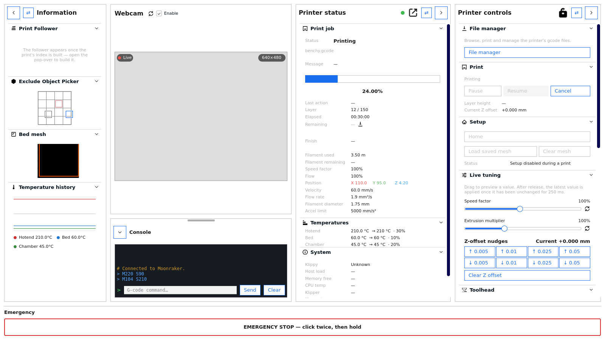

The Monitor dashboard: printer status, information panes and printer controls.

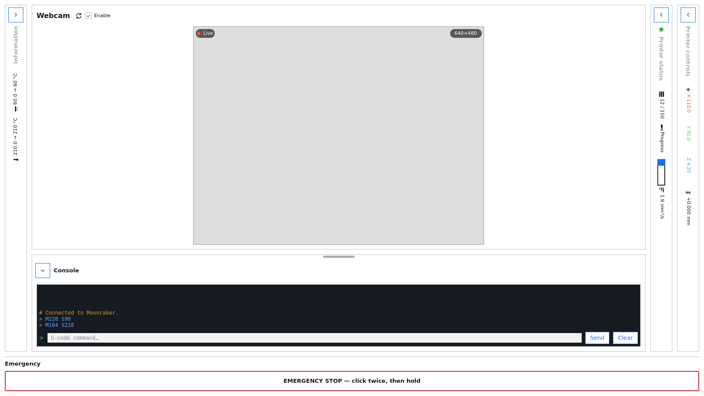
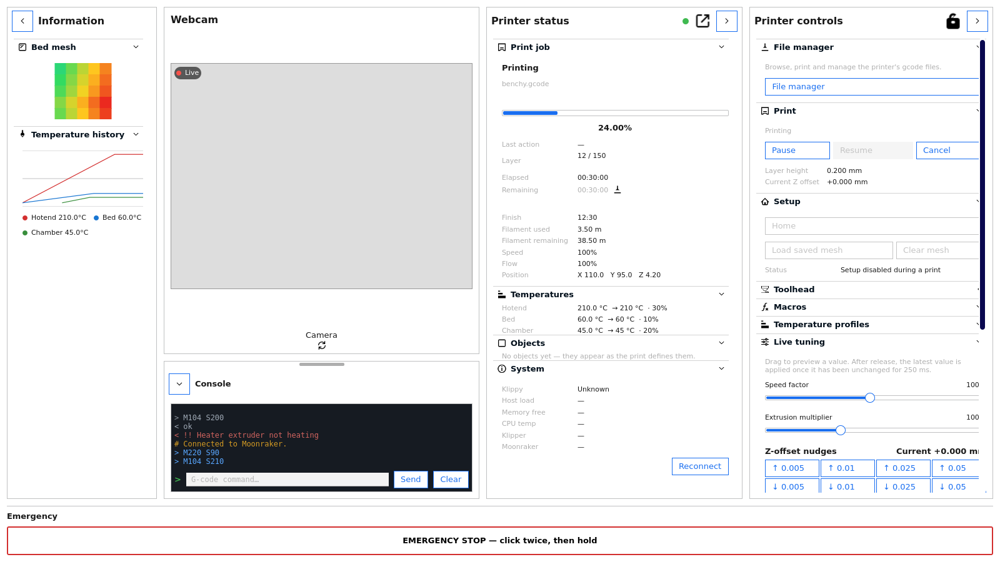
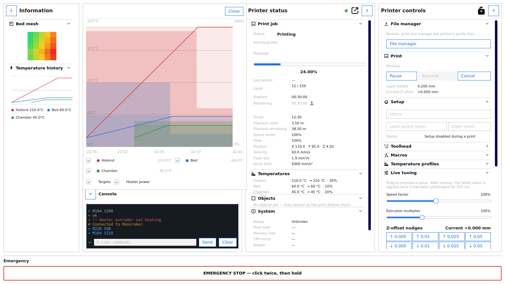

Panes collapse to the window edge with a rotated title; each pane's
sections collapse into an accordion like Cura's own settings.

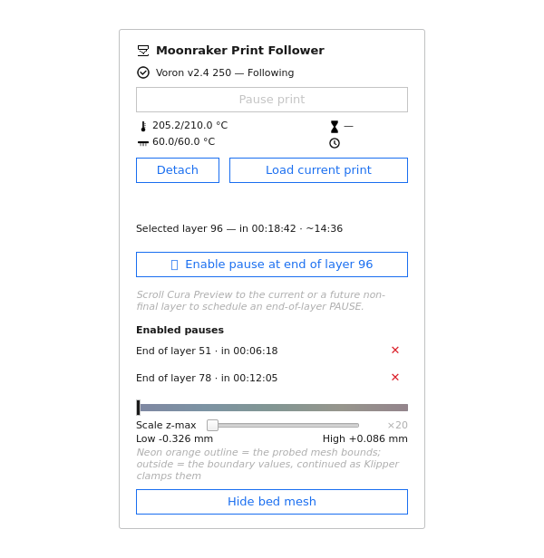

The Preview floating panel: follow controls, bed-mesh view and pause-at-layer.

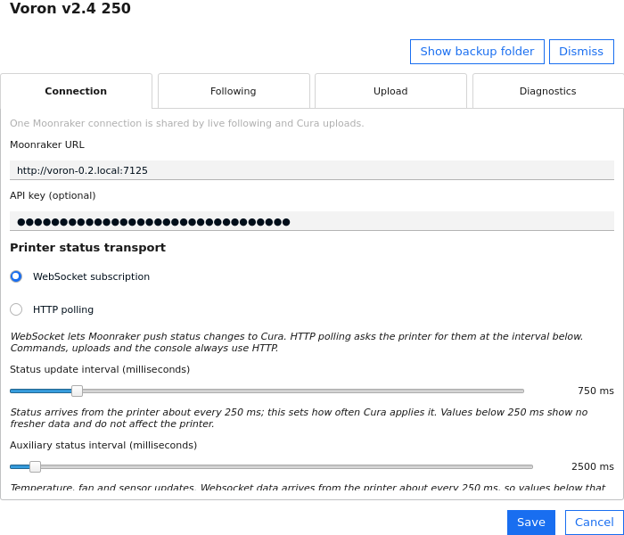
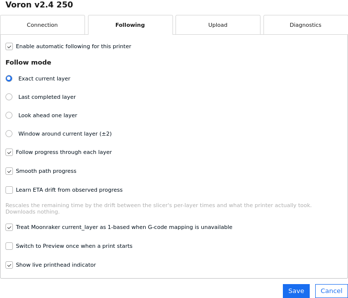
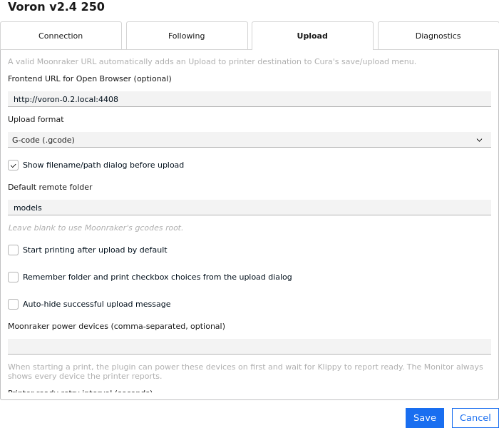
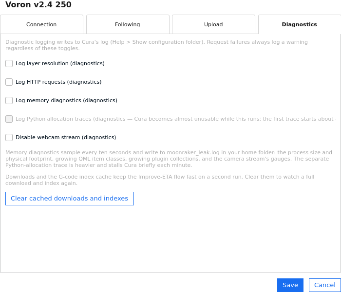

The settings tabs: Connection, Following, Upload and Diagnostics.

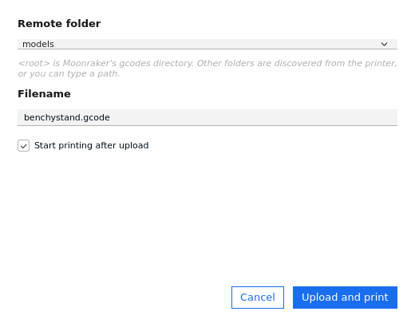

The Cura-to-Moonraker upload dialog.

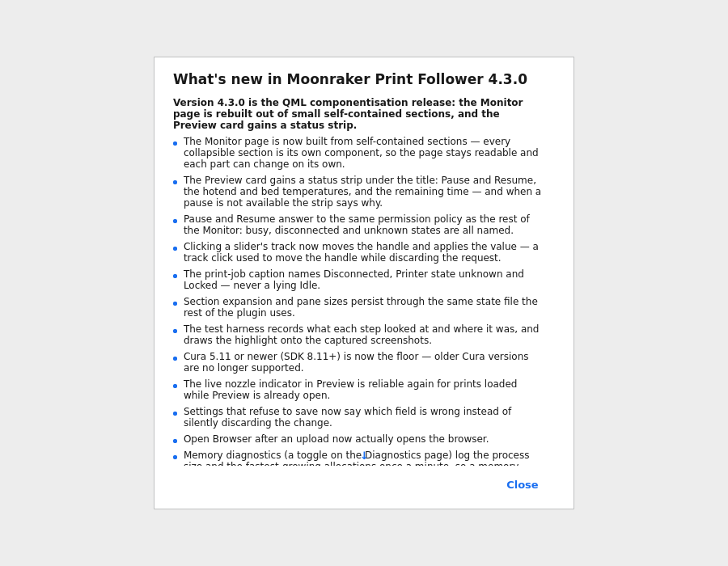

The once-per-version what's-new popup: the new release's items open
at the top, previous versions in collapsed sections, the project link
at the bottom.

## Moonraker transport

Follower live status uses a Moonraker websocket subscription by default, with HTTP polling selectable per printer (and the automatic fallback where subscriptions are unavailable).

- the configured interval is used while the connection is healthy
- failed requests back off through 1 s → 2 s → 5 s → 10 s → 30 s
- the normal interval resumes immediately after a successful response
- capabilities are inferred from the objects Moonraker actually exposes

Monitor consumes the same core status stream as the follower. Webcam configuration is discovered independently because it changes rarely. Uploads use Moonraker's HTTP file API with multipart form data. Power-device, print-control, printer-readiness and Monitor auxiliary requests also use Moonraker HTTP endpoints. The websocket feed is the default for new and upgraded installs; commands, uploads and the console always use HTTP. There is no automatic printer discovery.

## Large G-code handling

Large G-code files used by the follower are streamed and indexed without loading the complete file into Python memory. Very large files use a compact layer index and hydrate detailed motion information only for layers that need it. The next layer is prepared ahead of the transition; if its detailed index is not ready yet, Preview briefly holds at the start of that layer rather than showing a coarse estimate and then jumping backwards.

Persistent indexes are validated against remote file identity before reuse. Layer markers are recognised for Cura, PrusaSlicer, SuperSlicer and OrcaSlicer, with `SET_PRINT_STATS_INFO CURRENT_LAYER=...` available as a self-describing fallback.

## Installation

### Cura package

Release builds use the canonical Cura/Marketplace package id `MoonrakerPrintFollower`. CI compiles and tests the plugin, builds the `.curapackage`, verifies its Marketplace layout and uploads the installable package as a workflow artifact.

### Manual installation from source

For development/testing:

1. Open **Help → Show Configuration Folder** in Cura.
2. Open that configuration folder's `plugins` directory.
3. Create a `MoonrakerPrintFollower` directory there if necessary.
4. Copy the contents of this repository's `plugins` directory into it.
5. Restart Cura completely.
6. Open **Settings → Printer → Manage Printers** and select **Configure Moonraker**.

When replacing another development build with the same version number, uninstall/remove the existing plugin files and restart Cura before installing the replacement so Cura cannot retain stale Python or QML files.

## Upgrade compatibility

The 1.0.x and 1.1.x follower-settings migration remains supported. Existing legacy global follower settings are migrated once to the active Cura printer after Cura has established its global machine stack.

Version 3.0.0 additionally migrates compatible upload and fallback-camera settings from the standalone Moonraker Connection plugin. Neither migration forces Cura's lazy `MachineManager` into existence during early plugin loading.

## Internal structure

High-risk logic is separated into focused modules. The authoritative ownership map — which module owns which mutable domain — lives in `ARCHITECTURE.md`, together with the design rules and the import/dependency contract enforced by the test suite. A few landmarks:

- `FollowerRuntime.py` — the composition root; constructs the follower's components and implements no domain policy
- `PrintCoordinator.py` — cross-domain orchestration with explicit constructor dependencies
- `PrinterConfig.py` — unified per-Cura-machine settings, URL normalisation and both migrations
- `MoonrakerFollowerMachineAction.py` — native Manage Printers configuration backend
- `MoonrakerFollowerConfiguration.qml` — Connection / Following / Upload settings UI
- `MoonrakerOutputDevicePlugin.py` — exposes the Moonraker upload destination and Monitor view for the active Cura printer
- `MoonrakerOutputDevice.py` — G-code/UFP writing, power/readiness orchestration, multipart upload, progress and browser handoff
- `UploadController.py` — one upload operation: discovery, readiness, multipart streaming and cancellation
- `MoonrakerUploadDialog.qml` — per-upload remote path/name/start-print dialog
- `MoonrakerMonitorModel.py` — the single Qt Monitor model; declarative properties over controller projections
- `MonitorData.py` — Monitor request lifetime, category timers and the frozen Monitor snapshot
- `MonitorControls.py` / `MonitorCommands.py` / `MonitorTuning.py` / `MonitorCamera.py` — focused Monitor policy owners
- `MonitorFormatting.py` — pure projections, parsers and the shared printer-object classification table
- `MoonrakerMonitor.qml` — Cura Monitor dashboard presentation
- `MoonrakerClient.py` — resilient live-status HTTP polling, retry backoff and capability detection
- `MoonrakerSession.py` — session state, poll policy, coalescing and command acknowledgement
- `MoonrakerTransport.py` — the only module that constructs a `QNetworkAccessManager`
- `FollowController.py` — follower state machine and follow-mode decisions
- `PreviewFollower.py` — Preview state, attachment, path progress and ETA
- `PreviewFormatting.py` — pure status/icon/pause projections for the Preview panel
- `BedMeshPresenter.py` — the active mesh overlay, visibility preference and mesh controls
- `CuraIntegration.py` / `CuraAdapter.py` / `CuraLifecycleBridge.py` — Cura API isolation and lifecycle guards
- `GCodeIndex.py` — streaming/compact parsing, lazy layer hydration and persistent index cache
- `MoonrakerProtocol.py` — endpoint construction, file identity and coordinate conversion
- `DownloadStream.py` — bounded streaming G-code downloads

## Development and release checks

The standard-library `unittest` suite under `tests/` protects established follower behaviour and the unified upload/Monitor path. Contracts cover single-active-printer ownership, per-printer settings, standalone-plugin migration, HTTP status handling, follow modes, startup safety, manual Preview override detection, multiple slicer layer markers, compact/lazy indexes, G-code/UFP upload, power-device startup, non-blocking readiness waits, upload cancellation, multipart uploads, webcam migration/discovery, Monitor layer resolution, Monitor controls and Cura SDK compatibility.

Release auditing also checks that shipped plugin sources do not contain release nicknames in runtime comments/UI, and that the source contains no hard-coded real printer names, local-network addresses or literal sample API keys. Example network values must use reserved non-routable domains.
